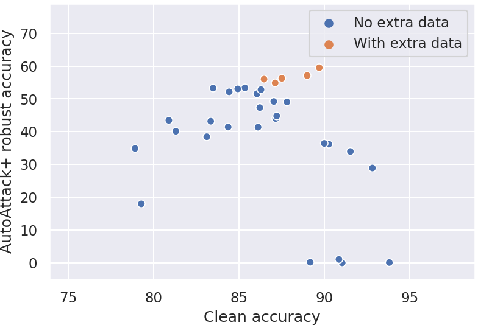

# 📊 AdvBench: tracking the progress in adversarial robustness


## Main idea
The goal of **`AdvBench`** is to systematically track the *real* progress in adversarial robustness. 
There are already [more than 2'000 papers](https://nicholas.carlini.com/writing/2019/all-adversarial-example-papers.html) 
on this topic, but it is still unclear which approaches *really* work and which only lead to [overestimated robustness](https://arxiv.org/abs/1802.00420).
We start from benchmarking the Linf-robustness since it is the most studied setting in the literature. 
We plan to extend the benchmark to other threat models in the future: first to other Lp-norms and then to more general perturbation sets 
(Wasserstein perturbations, common corruptions, etc).

Robustness evaluation *in general* is not straightforward and requires adaptive attacks ([Tramer et al., 2020](https://arxiv.org/abs/2002.08347)).
Thus, in order to establish a reliable *standardized* benchmark, we need to impose some restrictions on the defenses we consider.
In particular, **we accept only defenses that are (1) differentiable, (2) have a fully determinstic forward pass (i.e. no randomness) that
(3) does not have an optimization loop.** Usually, defenses that rely on these 3 mechanisms make gradient-based attacks 
harder but do not substantially improve robustness ([Carlini et al., 2019](https://arxiv.org/abs/1902.06705)).

**`AdvBench`** consists of two parts: 
- a website with the leaderboard based on many recent papers (plots below 👇)
- a collection of the most robust models, **Model Zoo**, which are very easy to use for any application (see the tutorial below after FAQ 👇)

<p align="center">  </p>
<p align="center">  </p>


## FAQ
**Q**: Wait, how is it different from [robust-ml.org](https://www.robust-ml.org/)? 🤔 \
**A**: [robust-ml.org](https://www.robust-ml.org/) focuses on *adaptive* evaluations, but we provide a **standardized benchmark**. Adaptive evaluations
are great but very time consuming and not standardized.

**Q**: How is it related to libraries like `foolbox` / `cleverhans` / `advertorch`? 🤔 \
**A**: These libraries provide implementations of different *attacks*. Besides the standardized benchmark, **`AdvBench`** 
additionally provides a repository of the most robust models. So you can start using the
robust models in one line of code (see the tutorial below 👇).

**Q**: I've heard that Lp-robustness is boring. Why would you even evaluate Lp-robustness in 2020? 🤔 \
**A**: There are numerous interesting applications of Lp-robustness that span 
transfer learning ([Salman et al. (2020)](https://arxiv.org/abs/2007.08489), [Utrera et al. (2020)](https://arxiv.org/abs/2007.05869)), 
interpretability ([Tsipras et al. (2018)](https://arxiv.org/abs/1805.12152), [Kaur et al. (2019)](https://arxiv.org/abs/1910.08640), [Engstrom et al. (2019)](https://arxiv.org/abs/1906.00945))
generalization ([Xie et al. (2019)](https://arxiv.org/abs/1911.09665), [Zhu et al. (2019)](https://arxiv.org/abs/1909.11764), [Bochkovskiy et al. (2020)](https://arxiv.org/abs/2004.10934)), 
security ([Tramèr et al. (2018)](https://arxiv.org/abs/1811.03194), [Saadatpanah et al. (2019)](https://arxiv.org/abs/1906.07153)). 
See also [this twitter thread](https://twitter.com/SebastienBubeck/status/1284287915837624320) for a more detailed discussion.

**Q**: What if I have a better attack than the one used in this benchmark? 🤔 \
**A**: We will be happy to add a better attack or any adaptive evaluation that would complement our default standardized attacks.

TODO: add QA whether our restrictions on the defenses are significant? answer: not really, the attacks based on randomness 
(except, those with provable guarantees []() TODO: a few links) or an optimization loop just make the attack much harder to 
perform, e.g. by increasing the variance of the gradients.


## Model Zoo: quick tour
The goal of our **Model Zoo** is to simplify the usage of robust models as much as possible.
Check out our notebook here 👉 `notebooks/quick_start.ipynb` for a quick start. It is also summarized below 👇.

First, install **`AdvBench`**:
```bash
git clone https://github.com/fra31/advbench && cd advbench
pip install -r requirements.txt
```
TODO: [later] install should be done with pip ideally

Now let's try to load CIFAR-10 and the most robust CIFAR-10 model from [Carmon2019Unlabeled](https://arxiv.org/abs/1905.13736) 
that achieves 59.50% robust accuracy evaluated with AA under eps=8/255:
```python
from data import load_cifar10
x_test, y_test = load_cifar10(n_examples=50)

from utils import load_model
model = load_model(model_name='Carmon2019Unlabeled').cuda().eval()
```
TODO: maybe do cuda() and eval() automatically?

Now let's try to evaluate its robustness with a cheap version [AutoAttack](https://arxiv.org/abs/2003.01690) from 
ICML'20 with 2/4 attacks (only APGD-CE and APGD-DLR):
```python
from attacks.autoattack import AutoAttack
adversary = AutoAttack(model, norm='Linf', eps=8/255, version='custom', attacks_to_run=['apgd-ce', 'apgd-dlr'])
adversary.apgd.n_restarts = 1
x_adv = adversary.run_standard_evaluation(x_test, y_test)
-------
>>> initial accuracy: 92.00%
>>> apgd-ce - 1/1 - 19 out of 46 successfully perturbed
>>> robust accuracy after APGD-CE: 54.00% (total time 10.3 s)
>>> apgd-dlr - 1/1 - 1 out of 27 successfully perturbed
>>> robust accuracy after APGD-DLR: 52.00% (total time 17.0 s)
>>> max Linf perturbation: 0.03137, nan in tensor: 0, max: 1.00000, min: 0.00000
>>> robust accuracy: 52.00%
```
Note that for our standardized evaluation of Linf-robustness we use the *full* version of AutoAttack which is slower but 
more accurate (for that just use `adversary = AutoAttack(model, norm='Linf', eps=8/255, version='standard')`).

You can also easily plug in any existing library with adversarial attacks such as [FoolBox](https://github.com/bethgelab/foolbox):
```python
import foolbox as fb
fmodel = fb.PyTorchModel(model, bounds=(0, 1))

_, advs, success = fb.attacks.LinfPGD()(fmodel, images, labels, epsilons=[8/255])
```

TODO: test the foolbox part (python 3.7 is needed for this), insert its output

TODO: add also advertorch if it's not too long

TODO: write somewhere that we are not too "AA-centered", but open to other attacks if they show a better performance than AA on Linf/L2.


## Model Zoo: list of models
In order to use a model, you just need to know its ID, e.g. **Carmon2019Unlabeled**, and to run: 
```python 
model = load_model(model_name='Carmon2019Unlabeled')
```
which automatically downloads the model (all models are defined in `model_zoo/models.py`).

You can find all available model IDs in the table below (note that the full leaderboard contains more models): 

| # | Model ID | Paper | Clean accuracy | Robust accuracy | Architecture | Venue |
|:---:|---|---|:---:|:---:|:---:|:---:|
| <sub>**1**</sub> | <sub>**Carmon2019Unlabeled**</sub> | <sub>*[Unlabeled Data Improves Adversarial Robustness](https://arxiv.org/abs/1905.13736)*</sub> | <sub>89.69%</sub> | <sub>59.53%</sub> | <sub>WideResNet-28-10</sub> | <sub>NeurIPS 2019</sub> |
| <sub>**2**</sub> | <sub>**Sehwag2020Hydra**</sub> | <sub>*[HYDRA: Pruning Adversarially Robust Neural Networks](https://arxiv.org/abs/2002.10509)*</sub> | <sub>88.98%</sub> | <sub>57.14%</sub> | <sub>WideResNet-28-10</sub> | <sub>Unpublished</sub> |
| <sub>**3**</sub> | <sub>**Wang2020Improving**</sub> | <sub>*[Improving Adversarial Robustness Requires Revisiting Misclassified Examples](https://openreview.net/forum?id=rklOg6EFwS)*</sub> | <sub>87.50%</sub> | <sub>56.29%</sub> | <sub>WideResNet-28-10</sub> | <sub>ICLR 2020</sub> |
| <sub>**4**</sub> | <sub>**Hendrycks2019Using**</sub> | <sub>*[Using Pre-Training Can Improve Model Robustness and Uncertainty](https://arxiv.org/abs/1901.09960)*</sub> | <sub>87.11%</sub> | <sub>54.92%</sub> | <sub>WideResNet-28-10</sub> | <sub>ICML 2019</sub> |
| <sub>**5**</sub> | <sub>**Pang2020Boosting**</sub> | <sub>*[Boosting Adversarial Training with Hypersphere Embedding](https://arxiv.org/abs/2002.08619)*</sub> | <sub>85.14%</sub> | <sub>53.74%</sub> | <sub>WideResNet-34-20</sub> | <sub>Unpublished</sub> |
| <sub>**6**</sub> | <sub>**Rice2020Overfitting**</sub> | <sub>*[Overfitting in adversarially robust deep learning](https://arxiv.org/abs/2002.11569)*</sub> | <sub>85.34%</sub> | <sub>53.42%</sub> | <sub>WideResNet-34-20</sub> | <sub>ICML 2020</sub> |
| <sub>**7**</sub> | <sub>**Huang2020Self**</sub> | <sub>*[Self-Adaptive Training: beyond Empirical Risk Minimization](https://arxiv.org/abs/2002.10319)*</sub> | <sub>83.48%</sub> | <sub>53.34%</sub> | <sub>WideResNet-34-10</sub> | <sub>Unpublished</sub> |
| <sub>**8**</sub> | <sub>**Zhang2019Theoretically**</sub> | <sub>*[Theoretically Principled Trade-off between Robustness and Accuracy](https://arxiv.org/abs/1901.08573)*</sub> | <sub>84.92%</sub> | <sub>53.08%</sub> | <sub>WideResNet-34-10</sub> | <sub>ICML 2019</sub> |
| <sub>**9**</sub> | <sub>**Chen2020Adversarial**</sub> | <sub>*[Adversarial Robustness: From Self-Supervised Pre-Training to Fine-Tuning](https://arxiv.org/abs/2003.12862)*</sub> | <sub>86.04%</sub> | <sub>51.56%</sub> | <sub>ResNet-50</sub> | <sub>CVPR 2020</sub> |
| <sub>**10**</sub> | <sub>**Engstrom2019Robustness**</sub> | <sub>*[Robustness library](https://github.com/MadryLab/robustness)*</sub> | <sub>87.03%</sub> | <sub>49.25%</sub> | <sub>ResNet-50</sub> | <sub>Unpublished</sub> |
| <sub>**11**</sub> | <sub>**Zhang2019You**</sub> | <sub>*[You Only Propagate Once: Accelerating Adversarial Training via Maximal Principle](https://arxiv.org/abs/1905.00877)*</sub> | <sub>87.20%</sub> | <sub>44.83%</sub> | <sub>WideResNet-34-10</sub> | <sub>NeurIPS 2019</sub> |
| <sub>**12**</sub> | <sub>**Wong2020Fast**</sub> | <sub>*[Fast is better than free: Revisiting adversarial training](https://arxiv.org/abs/2001.03994)*</sub> | <sub>83.34%</sub> | <sub>43.21%</sub> | <sub>ResNet-18</sub> | <sub>ICLR 2020</sub> |
| <sub>**13**</sub> | <sub>**Ding2020MMA**</sub> | <sub>*[MMA Training: Direct Input Space Margin Maximization through Adversarial Training](https://openreview.net/forum?id=HkeryxBtPB)*</sub> | <sub>84.36%</sub> | <sub>41.44%</sub> | <sub>WideResNet-28-4</sub> | <sub>ICLR 2020</sub> |


## How to contribute
Contributions to **`AdvBench`** are very welcome! Here is how you can help us:
- Do you know some interesting paper that is not listed in the leaderboard? Consider adding new models (see the instructions below 👇).
- Do you have in mind some better *standardized* attack? Do you want to extend **`AdvBench`** to other threat models? We'll be glad to discuss that!
- Do you have an idea how to make the existing codebase better? Just open a pull request or create an issue and we'll be happy to discuss potential changes. 


## Adding a new model to AdvBench
In order to add a new model, submit a pull request where you specify the claim, model definition, and model checkpoint:

- **Claim**: `model_claims/<Name><Year><FirstWordOfTheTitle>.json`: follow the convention of the existing json-files to specify the information to be displayed on the website. 
Here is an example from `model_info/Rice2020Overfitting.json`:
```json
{
  "link": "https://arxiv.org/abs/2002.11569",
  "name": "Overfitting in adversarially robust deep learning",
  "authors": "Leslie Rice, Eric Wong, J. Zico Kolter",
  "additional_data": false,
  "number_forward_passes": 1,
  "dataset": "cifar10",
  "venue": "ICML 2020",
  "architecture": "WideResNet-34-20",
  "eps": "8/255",
  "clean_acc": "85.34",
  "reported": "58",
  "AA": "53.60",
  "AA+": "53.35"
}
```

- **Model definition**: `model_zoo/models.py`: add your model definition as a new class. For standard architectures (e.g., `WideResNet`) consider
 inheriting the class defined in `wide_resnet.py` or `resnet.py`. For example:
```python
class Rice2020OverfittingNet(WideResNet):
    def __init__(self, depth, widen_factor):
        super(Rice2020OverfittingNet, self).__init__(depth=depth, widen_factor=widen_factor, sub_block1=False)
        self.mu = torch.Tensor([0.4914, 0.4822, 0.4465]).float().view(3, 1, 1).cuda()
        self.sigma = torch.Tensor([0.2471, 0.2435, 0.2616]).float().view(3, 1, 1).cuda()

    def forward(self, x):
        x = (x - self.mu) / self.sigma
        return super(Rice2020OverfittingNet, self).forward(x)
```

- **Model checkpoint**: `model_zoo/models.py`: And also add your model entry in `model_dicts` which should also contain 
the *Google Drive ID* with your pytorch model so that it can be downloaded automatically from Google Drive:
```
    ('Rice2020Overfitting', {
        'model': Rice2020OverfittingNet(34, 20),
        'gdrive_id': '1vC_Twazji7lBjeMQvAD9uEQxi9Nx2oG-',
    })
```


## Model Zoo: automatic tests
Run the following scripts to test the existing models from the **Model Zoo**:
- `python tests/test_clean_acc_fast.py`: fast testing on 200 examples that clean accuracy exceeds some threshold.
- `python tests/test_clean_acc_jsons.py`: testing on 10'000 examples that clean accuracy of the models matches the one 
mentioned in the `model_info` jsons.

Note that you can specify some configurations like `batch_size`, `data_dir`, `model_dir` in `config.py` either as 
default parameters or as parameters from the command line.


## Citation
Would you like to refer to the **`AdvBench`** leaderboard? Or are you using models from the **Model Zoo*? \
Then consider citing our white paper about **`AdvBench`** (currently in preparation, stay tuned).


## Contact 
Feel free to contact us about anything related to **`AdvBench`** by creating an issue, a pull request or 
by email at `adversarial.benchmark@gmail.com`.
