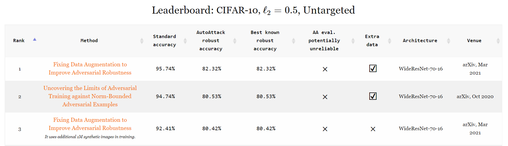

# RobustBench: a standardized adversarial robustness benchmark

**Francesco Croce\* (University of Tübingen), Maksym Andriushchenko\* (EPFL), Vikash Sehwag\* (Princeton University), 
Nicolas Flammarion (EPFL), Mung Chiang (Purdue University), Prateek Mittal (Princeton University), Matthias Hein (University of Tübingen)**

**Leaderboard**: [https://robustbench.github.io/](https://robustbench.github.io/)

**Paper:** [https://arxiv.org/abs/2010.09670](https://arxiv.org/abs/2010.09670)

<p align="center">
<p align="center">

## Main idea
  
The goal of **`RobustBench`** is to systematically track the *real* progress in adversarial robustness. 
There are already [more than 2'000 papers](https://nicholas.carlini.com/writing/2019/all-adversarial-example-papers.html) 
on this topic, but it is still unclear which approaches really work and which only lead to [overestimated robustness](https://arxiv.org/abs/1802.00420).
We start from benchmarking the Linf-robustness since it is the most studied setting in the literature. 
We plan to extend the benchmark to other threat models in the future: first to other Lp-norms and then to more general perturbation sets 
(Wasserstein perturbations, common corruptions, etc).

Robustness evaluation *in general* is not straightforward and requires adaptive attacks ([Tramer et al., (2020)](https://arxiv.org/abs/2002.08347)).
Thus, in order to establish a reliable *standardized* benchmark, we need to impose some restrictions on the defenses we consider.
In particular, **we accept only defenses that are (1) have in general non-zero gradients wrt the inputs, (2) have a fully deterministic forward pass (i.e. no randomness) that
(3) does not have an optimization loop.** Often, defenses that violate these 3 principles only make gradient-based attacks 
harder but do not substantially improve robustness ([Carlini et al., (2019)](https://arxiv.org/abs/1902.06705)) except those
that can present concrete provable guarantees (e.g. [Cohen et al., (2019)](https://arxiv.org/abs/1902.02918)).

**`RobustBench`** consists of two parts: 
- a website [https://robustbench.github.io/](https://robustbench.github.io/) with the leaderboard based on many recent papers (plots below 👇)
- a collection of the most robust models, **Model Zoo**, which are easy to use for any downstream application (see the tutorial below after FAQ 👇)

<!-- <p align="center">  </p> -->
<!-- <p align="center">  </p> -->
<p align="center"></p>

## FAQ

**Q**: Wait, how does this leaderboard differ from the [AutoAttack leaderboard](https://github.com/fra31/auto-attack)? 🤔 \
**A**: The [AutoAttack leaderboard](https://github.com/fra31/auto-attack) is maintained simultaneously with the `RobustBench` L2 / Linf leaderboards by [Francesco Croce](https://github.com/fra31/), and all the changes to either of them will be synchronized (given that the 3 restrictions on the models are met for the `RobustBench` leaderboard). One can see the current L2 / Linf `RobustBench` leaderboard as a continuously updated fork of the [AutoAttack leaderboard](https://github.com/fra31/auto-attack) extended by adaptive evaluations, Model Zoo, and clear restrictions on the models we accept. And in the future, we will extend `RobustBench` with other threat models and potentially with a different standardized attack if it's shown to perform better than AutoAttack.

**Q**: Wait, how is it different from [robust-ml.org](https://www.robust-ml.org/)? 🤔 \
**A**: [robust-ml.org](https://www.robust-ml.org/) focuses on *adaptive* evaluations, but we provide a **standardized benchmark**. Adaptive evaluations
are great (e.g., see [Tramer et al., 2020](https://arxiv.org/abs/2002.08347)) but very time consuming and not standardized. Instead, we argue that one can estimate robustness accurately *without* adaptive attacks but for this one has to introduce some restrictions on the considered models.

**Q**: How is it related to libraries like `foolbox` / `cleverhans` / `advertorch`? 🤔 \
**A**: These libraries provide implementations of different *attacks*. Besides the standardized benchmark, **`RobustBench`** 
additionally provides a repository of the most robust models. So you can start using the
robust models in one line of code (see the tutorial below 👇).

**Q**: Why is Lp-robustness still interesting in 2020? 🤔 \
**A**: There are numerous interesting applications of Lp-robustness that span 
transfer learning ([Salman et al. (2020)](https://arxiv.org/abs/2007.08489), [Utrera et al. (2020)](https://arxiv.org/abs/2007.05869)), 
interpretability ([Tsipras et al. (2018)](https://arxiv.org/abs/1805.12152), [Kaur et al. (2019)](https://arxiv.org/abs/1910.08640), [Engstrom et al. (2019)](https://arxiv.org/abs/1906.00945)),
security ([Tramèr et al. (2018)](https://arxiv.org/abs/1811.03194), [Saadatpanah et al. (2019)](https://arxiv.org/abs/1906.07153)),
generalization ([Xie et al. (2019)](https://arxiv.org/abs/1911.09665), [Zhu et al. (2019)](https://arxiv.org/abs/1909.11764), [Bochkovskiy et al. (2020)](https://arxiv.org/abs/2004.10934)), 
robustness to unseen perturbations ([Xie et al. (2019)](https://arxiv.org/abs/1911.09665), [Kang et al. (2019)](https://arxiv.org/abs/1905.01034)),
stabilization of GAN training ([Zhong et al. (2020)](https://arxiv.org/abs/2008.03364)).

**Q**: Does this benchmark **only** focus on Lp-robustness? 🤔 \
**A**: Lp-robustness is the most well-studied area, so we focus on it first. However, in the future, we plan 
to extend the benchmark to other perturbations sets beyond Lp-balls.

**Q**: What about verified adversarial robustness? 🤔 \
**A**: We specifically focus on defenses which improve empirical robustness, given the lack of clarity regarding 
which approaches really improve robustness and which only make some particular attacks unsuccessful.
For methods targeting verified robustness, we encourage the readers to check out [Salman et al. (2019)](https://arxiv.org/abs/1902.08722) 
and [Li et al. (2020)](https://arxiv.org/abs/2009.04131).

**Q**: What if I have a better attack than the one used in this benchmark? 🤔 \
**A**: We will be happy to add a better attack or any adaptive evaluation that would complement our default standardized attacks.

## Model Zoo: quick tour

The goal of our **Model Zoo** is to simplify the usage of robust models as much as possible.
Check out our Colab notebook here 👉 [RobustBench: quick start](https://colab.research.google.com/drive/1MQY_7O9vj7ixD5ilVRbdQwlNPFvxifHV) 
for a quick introduction. It is also summarized below 👇.

First, install **`RobustBench`**:
```bash
pip install git+https://github.com/RobustBench/robustbench.git@v0.1
```

Now let's try to load CIFAR-10 and the most robust CIFAR-10 model from [Carmon2019Unlabeled](https://arxiv.org/abs/1905.13736) 
that achieves 59.53% robust accuracy evaluated with AA under eps=8/255:

```python
from robustbench.data import load_cifar10

x_test, y_test = load_cifar10(n_examples=50)

from robustbench.utils import load_model

model = load_model(model_name='Carmon2019Unlabeled', dataset='cifar10', threat_model='Linf')
```

Let's try to evaluate the robustness of this model. We can use any favourite library for this. For example, [FoolBox](https://github.com/bethgelab/foolbox)
implements many different attacks. We can start from a simple PGD attack:
```python
!pip install -q foolbox
import foolbox as fb
fmodel = fb.PyTorchModel(model, bounds=(0, 1))

_, advs, success = fb.attacks.LinfPGD()(fmodel, x_test.to('cuda:0'), y_test.to('cuda:0'), epsilons=[8/255])
print('Robust accuracy: {:.1%}'.format(1 - success.float().mean()))
```
```
>>> Robust accuracy: 58.0%
```
Wonderful! Can we do better with a more accurate attack?

Let's try to evaluate its robustness with a cheap version [AutoAttack](https://arxiv.org/abs/2003.01690) from ICML 2020 with 2/4 attacks (only APGD-CE and APGD-DLR):
```python
# autoattack is installed as a dependency of robustbench so there is not need to install it separately
from autoattack import AutoAttack
adversary = AutoAttack(model, norm='Linf', eps=8/255, version='custom', attacks_to_run=['apgd-ce', 'apgd-dlr'])
adversary.apgd.n_restarts = 1
x_adv = adversary.run_standard_evaluation(x_test, y_test)
```
```
>>> initial accuracy: 92.00%
>>> apgd-ce - 1/1 - 19 out of 46 successfully perturbed
>>> robust accuracy after APGD-CE: 54.00% (total time 10.3 s)
>>> apgd-dlr - 1/1 - 1 out of 27 successfully perturbed
>>> robust accuracy after APGD-DLR: 52.00% (total time 17.0 s)
>>> max Linf perturbation: 0.03137, nan in tensor: 0, max: 1.00000, min: 0.00000
>>> robust accuracy: 52.00%
```
Note that for our standardized evaluation of Linf-robustness we use the *full* version of AutoAttack which is slower but 
more accurate (for that just use `adversary = AutoAttack(model, norm='Linf', eps=8/255)`).

What about other types of perturbations? Is Lp-robustness useful there? We can evaluate the available models on more general perturbations. 
For example, let's take images corrupted by fog perturbations from CIFAR-10-C with the highest level of severity (5). 
Are different Linf robust models perform better on them?

```python
from robustbench.data import load_cifar10c
from robustbench.utils import clean_accuracy

corruptions = ['fog']
x_test, y_test = load_cifar10c(n_examples=1000, corruptions=corruptions, severity=5)

for model_name in ['Standard', 'Engstrom2019Robustness', 'Rice2020Overfitting',
                   'Carmon2019Unlabeled']:
 model = load_model(model_name, dataset='cifar10', threat_model='Linf')
 acc = clean_accuracy(model, x_test, y_test)
 print(f'Model: {model_name}, CIFAR-10-C accuracy: {acc:.1%}')
``` 
```
>>> Model: Standard, CIFAR-10-C accuracy: 74.4%
>>> Model: Engstrom2019Robustness, CIFAR-10-C accuracy: 38.8%
>>> Model: Rice2020Overfitting, CIFAR-10-C accuracy: 22.0%
>>> Model: Carmon2019Unlabeled, CIFAR-10-C accuracy: 31.1%
```
As we can see, **all** these Linf robust models perform considerably worse than the standard model on this type of corruptions. 
This curious phenomenon was first noticed in [Adversarial Examples Are a Natural Consequence of Test Error in Noise](https://arxiv.org/abs/1901.10513) 
and explained from the frequency perspective in [A Fourier Perspective on Model Robustness in Computer Vision](https://arxiv.org/abs/1906.08988). 

However, on average adversarial training *does* help on CIFAR-10-C. One can check this easily by loading all types of corruptions 
via `load_cifar10c(n_examples=1000, severity=5)`, and repeating evaluation on them.


## Model Zoo
In order to use a model, you just need to know its ID, e.g. **Carmon2019Unlabeled**, and to run:

```python
from robustbench import load_model

model = load_model(model_name='Carmon2019Unlabeled', dataset='cifar10', threat_model='Linf')
```
which automatically downloads the model (all models are defined in `model_zoo/models.py`).

You can find all available model IDs in the table below (note that the full leaderboard contains more models): 

### Linf
| <sub>#</sub> | <sub>Model ID</sub> | <sub>Paper</sub> | <sub>Clean accuracy</sub> | <sub>Robust accuracy</sub> | <sub>Architecture</sub> | <sub>Venue</sub> |
|:---:|---|---|:---:|:---:|:---:|:---:|
| <sub>**1**</sub> | <sub><sup>**Gowal2020Uncovering_70_16_extra**</sup></sub> | <sub>*[Uncovering the Limits of Adversarial Training against Norm-Bounded Adversarial Examples](https://arxiv.org/abs/2010.03593)*</sub> | <sub>91.10%</sub> | <sub>65.87%</sub> | <sub>WideResNet-70-16</sub> | <sub>arXiv, Oct 2020</sub> |
| <sub>**2**</sub> | <sub><sup>**Gowal2020Uncovering_28_10_extra**</sup></sub> | <sub>*[Uncovering the Limits of Adversarial Training against Norm-Bounded Adversarial Examples](https://arxiv.org/abs/2010.03593)*</sub> | <sub>89.48%</sub> | <sub>62.76%</sub> | <sub>WideResNet-28-10</sub> | <sub>arXiv, Oct 2020</sub> |
| <sub>**3**</sub> | <sub><sup>**Wu2020Adversarial_extra**</sup></sub> | <sub>*[Adversarial Weight Perturbation Helps Robust Generalization](https://arxiv.org/abs/2004.05884)*</sub> | <sub>88.25%</sub> | <sub>60.04%</sub> | <sub>WideResNet-28-10</sub> | <sub>NeurIPS 2020</sub> |
| <sub>**4**</sub> | <sub><sup>**Carmon2019Unlabeled**</sup></sub> | <sub>*[Unlabeled Data Improves Adversarial Robustness](https://arxiv.org/abs/1905.13736)*</sub> | <sub>89.69%</sub> | <sub>59.53%</sub> | <sub>WideResNet-28-10</sub> | <sub>NeurIPS 2019</sub> |
| <sub>**5**</sub> | <sub><sup>**Sehwag2020Hydra**</sup></sub> | <sub>*[HYDRA: Pruning Adversarially Robust Neural Networks](https://arxiv.org/abs/2002.10509)*</sub> | <sub>88.98%</sub> | <sub>57.14%</sub> | <sub>WideResNet-28-10</sub> | <sub>NeurIPS 2020</sub> |
| <sub>**6**</sub> | <sub><sup>**Gowal2020Uncovering_70_16**</sup></sub> | <sub>*[Uncovering the Limits of Adversarial Training against Norm-Bounded Adversarial Examples](https://arxiv.org/abs/2010.03593)*</sub> | <sub>85.29%</sub> | <sub>57.14%</sub> | <sub>WideResNet-70-16</sub> | <sub>arXiv, Oct 2020</sub> |
| <sub>**7**</sub> | <sub><sup>**Gowal2020Uncovering_34_20**</sup></sub> | <sub>*[Uncovering the Limits of Adversarial Training against Norm-Bounded Adversarial Examples](https://arxiv.org/abs/2010.03593)*</sub> | <sub>85.64%</sub> | <sub>56.82%</sub> | <sub>WideResNet-34-20</sub> | <sub>arXiv, Oct 2020</sub> |
| <sub>**8**</sub> | <sub><sup>**Wang2020Improving**</sup></sub> | <sub>*[Improving Adversarial Robustness Requires Revisiting Misclassified Examples](https://openreview.net/forum?id=rklOg6EFwS)*</sub> | <sub>87.50%</sub> | <sub>56.29%</sub> | <sub>WideResNet-28-10</sub> | <sub>ICLR 2020</sub> |
| <sub>**9**</sub> | <sub><sup>**Wu2020Adversarial**</sup></sub> | <sub>*[Adversarial Weight Perturbation Helps Robust Generalization](https://arxiv.org/abs/2004.05884)*</sub> | <sub>85.36%</sub> | <sub>56.17%</sub> | <sub>WideResNet-34-10</sub> | <sub>NeurIPS 2020</sub> |
| <sub>**10**</sub> | <sub><sup>**Hendrycks2019Using**</sup></sub> | <sub>*[Using Pre-Training Can Improve Model Robustness and Uncertainty](https://arxiv.org/abs/1901.09960)*</sub> | <sub>87.11%</sub> | <sub>54.92%</sub> | <sub>WideResNet-28-10</sub> | <sub>ICML 2019</sub> |
| <sub>**11**</sub> | <sub><sup>**Pang2020Boosting**</sup></sub> | <sub>*[Boosting Adversarial Training with Hypersphere Embedding](https://arxiv.org/abs/2002.08619)*</sub> | <sub>85.14%</sub> | <sub>53.74%</sub> | <sub>WideResNet-34-20</sub> | <sub>NeurIPS 2020</sub> |
| <sub>**12**</sub> | <sub><sup>**Zhang2020Attacks**</sup></sub> | <sub>*[Attacks Which Do Not Kill Training Make Adversarial Learning Stronger](https://arxiv.org/abs/2002.11242)*</sub> | <sub>84.52%</sub> | <sub>53.51%</sub> | <sub>WideResNet-34-10</sub> | <sub>ICML 2020</sub> |
| <sub>**13**</sub> | <sub><sup>**Rice2020Overfitting**</sup></sub> | <sub>*[Overfitting in adversarially robust deep learning](https://arxiv.org/abs/2002.11569)*</sub> | <sub>85.34%</sub> | <sub>53.42%</sub> | <sub>WideResNet-34-20</sub> | <sub>ICML 2020</sub> |
| <sub>**14**</sub> | <sub><sup>**Huang2020Self**</sup></sub> | <sub>*[Self-Adaptive Training: beyond Empirical Risk Minimization](https://arxiv.org/abs/2002.10319)*</sub> | <sub>83.48%</sub> | <sub>53.34%</sub> | <sub>WideResNet-34-10</sub> | <sub>NeurIPS 2020</sub> |
| <sub>**15**</sub> | <sub><sup>**Zhang2019Theoretically**</sup></sub> | <sub>*[Theoretically Principled Trade-off between Robustness and Accuracy](https://arxiv.org/abs/1901.08573)*</sub> | <sub>84.92%</sub> | <sub>53.08%</sub> | <sub>WideResNet-34-10</sub> | <sub>ICML 2019</sub> |
| <sub>**16**</sub> | <sub><sup>**Chen2020Adversarial**</sup></sub> | <sub>*[Adversarial Robustness: From Self-Supervised Pre-Training to Fine-Tuning](https://arxiv.org/abs/2003.12862)*</sub> | <sub>86.04%</sub> | <sub>51.56%</sub> | <sub>ResNet-50 <br/> (3x ensemble)</sub> | <sub>CVPR 2020</sub> |
| <sub>**17**</sub> | <sub><sup>**Engstrom2019Robustness**</sup></sub> | <sub>*[Robustness library](https://github.com/MadryLab/robustness)*</sub> | <sub>87.03%</sub> | <sub>49.25%</sub> | <sub>ResNet-50</sub> | <sub>GitHub,<br>Oct 2019</sub> |
| <sub>**18**</sub> | <sub><sup>**Zhang2019You**</sup></sub> | <sub>*[You Only Propagate Once: Accelerating Adversarial Training via Maximal Principle](https://arxiv.org/abs/1905.00877)*</sub> | <sub>87.20%</sub> | <sub>44.83%</sub> | <sub>WideResNet-34-10</sub> | <sub>NeurIPS 2019</sub> |
| <sub>**19**</sub> | <sub><sup>**Wong2020Fast**</sup></sub> | <sub>*[Fast is better than free: Revisiting adversarial training](https://arxiv.org/abs/2001.03994)*</sub> | <sub>83.34%</sub> | <sub>43.21%</sub> | <sub>ResNet-18</sub> | <sub>ICLR 2020</sub> |
| <sub>**20**</sub> | <sub><sup>**Ding2020MMA**</sup></sub> | <sub>*[MMA Training: Direct Input Space Margin Maximization through Adversarial Training](https://openreview.net/forum?id=HkeryxBtPB)*</sub> | <sub>84.36%</sub> | <sub>41.44%</sub> | <sub>WideResNet-28-4</sub> | <sub>ICLR 2020</sub> |
| <sub>**21**</sub> | <sub><sup>**Standard**</sup></sub> | <sub>*[Standardly trained model](https://github.com/RobustBench/robustbench/)*</sub> | <sub>94.78%</sub> | <sub>0.00%</sub> | <sub>WideResNet-28-10</sub> | <sub>N/A</sub> |


### L2
| <sub>#</sub> | <sub>Model ID</sub> | <sub>Paper</sub> | <sub>Clean accuracy</sub> | <sub>Robust accuracy</sub> | <sub>Architecture</sub> | <sub>Venue</sub> |
|:---:|---|---|:---:|:---:|:---:|:---:|
| <sub>**1**</sub> | <sub><sup>**Gowal2020Uncovering_extra**</sup></sub> | <sub>*[Uncovering the Limits of Adversarial Training against Norm-Bounded Adversarial Examples](https://arxiv.org/abs/2010.03593)*</sub> | <sub>94.74%</sub> | <sub>80.53%</sub> | <sub>WideResNet-70-16</sub> | <sub>arXiv, Oct 2020</sub> |
| <sub>**2**</sub> | <sub><sup>**Gowal2020Uncovering**</sup></sub> | <sub>*[Uncovering the Limits of Adversarial Training against Norm-Bounded Adversarial Examples](https://arxiv.org/abs/2010.03593)*</sub> | <sub>90.90%</sub> | <sub>74.50%</sub> | <sub>WideResNet-70-16</sub> | <sub>arXiv, Oct 2020</sub> |
| <sub>**3**</sub> | <sub><sup>**Wu2020Adversarial**</sup></sub> | <sub>*[Adversarial Weight Perturbation Helps Robust Generalization](https://arxiv.org/abs/2004.05884)*</sub> | <sub>88.51%</sub> | <sub>73.66%</sub> | <sub>WideResNet-34-10</sub> | <sub>NeurIPS 2020</sub> |
| <sub>**4**</sub> | <sub><sup>**Augustin2020Adversarial**</sup></sub> | <sub>*[Adversarial Robustness on In- and Out-Distribution Improves Explainability](https://arxiv.org/abs/2003.09461)*</sub> | <sub>91.08%</sub> | <sub>72.91%</sub> | <sub>ResNet-50</sub> | <sub>ECCV 2020</sub> |
| <sub>**5**</sub> | <sub><sup>**Engstrom2019Robustness**</sup></sub> | <sub>*[Robustness library](https://github.com/MadryLab/robustness)*</sub> | <sub>90.83%</sub> | <sub>69.24%</sub> | <sub>ResNet-50</sub> | <sub>GitHub,<br>Sep 2019</sub> |
| <sub>**6**</sub> | <sub><sup>**Rice2020Overfitting**</sup></sub> | <sub>*[Overfitting in adversarially robust deep learning](https://arxiv.org/abs/2002.11569)*</sub> | <sub>88.67%</sub> | <sub>67.68%</sub> | <sub>ResNet-18</sub> | <sub>ICML 2020</sub> |
| <sub>**7**</sub> | <sub><sup>**Rony2019Decoupling**</sup></sub> | <sub>*[Decoupling Direction and Norm for Efficient Gradient-Based L2 Adversarial Attacks and Defenses](https://arxiv.org/abs/1811.09600)*</sub> | <sub>89.05%</sub> | <sub>66.44%</sub> | <sub>WideResNet-28-10</sub> | <sub>CVPR 2019</sub> |
| <sub>**8**</sub> | <sub><sup>**Ding2020MMA**</sup></sub> | <sub>*[MMA Training: Direct Input Space Margin Maximization through Adversarial Training](https://openreview.net/forum?id=HkeryxBtPB)*</sub> | <sub>88.02%</sub> | <sub>66.09%</sub> | <sub>WideResNet-28-4</sub> | <sub>ICLR 2020</sub> |
| <sub>**9**</sub> | <sub><sup>**Standard**</sup></sub> | <sub>*[Standardly trained model](https://github.com/RobustBench/robustbench/)*</sub> | <sub>94.78%</sub> | <sub>0.00%</sub> | <sub>WideResNet-28-10</sub> | <sub>N/A</sub> |


### Common Corruptions
| <sub>#</sub> | <sub>Model ID</sub> | <sub>Paper</sub> | <sub>Clean accuracy</sub> | <sub>Robust accuracy</sub> | <sub>Architecture</sub> | <sub>Venue</sub> |
|:---:|---|---|:---:|:---:|:---:|:---:|
| <sub>**1**</sub> | <sub><sup>**Hendrycks2020AugMix_ResNeXt**</sup></sub> | <sub>*[AugMix: A Simple Data Processing Method to Improve Robustness and Uncertainty](https://arxiv.org/abs/1912.02781)*</sub> | <sub>95.83%</sub> | <sub>89.09%</sub> | <sub>ResNeXt29_32x4d</sub> | <sub>ICLR 2020</sub> |
| <sub>**2**</sub> | <sub><sup>**Hendrycks2020AugMix_WRN**</sup></sub> | <sub>*[AugMix: A Simple Data Processing Method to Improve Robustness and Uncertainty](https://arxiv.org/abs/1912.02781)*</sub> | <sub>95.08%</sub> | <sub>88.82%</sub> | <sub>WideResNet-40-2</sub> | <sub>ICLR 2020</sub> |
| <sub>**3**</sub> | <sub><sup>**Kireev2021Effectiveness_RLATAugMixNoJSD**</sup></sub> | <sub>*[On the effectiveness of adversarial training against common corruptions](https://arxiv.org/abs/2103.02325)*</sub> | <sub>94.77%</sub> | <sub>88.53%</sub> | <sub>ResNet-18</sub> | <sub>arXiv, Mar 2021</sub> |
| <sub>**4**</sub> | <sub><sup>**Kireev2021Effectiveness_AugMixNoJSD**</sup></sub> | <sub>*[On the effectiveness of adversarial training against common corruptions](https://arxiv.org/abs/2103.02325)*</sub> | <sub>94.97%</sub> | <sub>86.60%</sub> | <sub>ResNet-18</sub> | <sub>arXiv, Mar 2021</sub> |
| <sub>**5**</sub> | <sub><sup>**Kireev2021Effectiveness_Gauss50percent**</sup></sub> | <sub>*[On the effectiveness of adversarial training against common corruptions](https://arxiv.org/abs/2103.02325)*</sub> | <sub>93.24%</sub> | <sub>85.04%</sub> | <sub>ResNet-18</sub> | <sub>arXiv, Mar 2021</sub> |
| <sub>**6**</sub> | <sub><sup>**Kireev2021Effectiveness_RLAT**</sup></sub> | <sub>*[On the effectiveness of adversarial training against common corruptions](https://arxiv.org/abs/2103.02325)*</sub> | <sub>93.10%</sub> | <sub>84.10%</sub> | <sub>ResNet-18</sub> | <sub>arXiv, Mar 2021</sub> |
| <sub>**7**</sub> | <sub><sup>**Standard**</sup></sub> | <sub>*[Standardly trained model](https://github.com/RobustBench/robustbench/)*</sub> | <sub>94.78%</sub> | <sub>73.46%</sub> | <sub>WideResNet-28-10</sub> | <sub>N/A</sub> |


## Notebooks
We host all the notebooks at Google Colab:
- [RobustBench: quick start](https://colab.research.google.com/drive/1MQY_7O9vj7ixD5ilVRbdQwlNPFvxifHV): a quick tutorial 
to get started that illustrates the main features of **`RobustBench`**.
- [RobustBench: json stats](https://colab.research.google.com/drive/19tgblr13SvaCpG8hoOTv6QCULVJbCec6): various plots based 
on the jsons from `model_info` (robustness over venues, robustness vs accuracy, etc).

Feel free to suggest a new notebook based on the **Model Zoo** or the jsons from `model_info`. We are very interested in
collecting new insights about benefits and tradeoffs between different perturbation types.

## How to contribute
Contributions to **`RobustBench`** are very welcome! You can help to improve **`RobustBench`**:
- Are you an author of a recent paper focusing on improving adversarial robustness? Consider adding new models (see the instructions below 👇).
- Do you have in mind some better *standardized* attack or an adaptive evaluation? Do you want to extend **`RobustBench`** to other threat models? We'll be glad to discuss that!
- Do you have an idea how to make the existing codebase better? Just open a pull request or create an issue and we'll be happy to discuss potential changes. 

## Adding a new model

#### Public model submission (leaderboard + Model Zoo)
In order to add a new model for a specific dataset-threat model combination, submit a pull request
where you specify the claim, model definition, and model checkpoint.

##### Claim

The claim can be computed in the following way:

```python
import torch

from robustbench import benchmark
from myrobust model import MyRobustModel

threat_model = "Linf"  # One of {"Linf", "L2", "corruptions"}
dataset = "cifar10"  # For the moment "cifar10" only is supported

model = MyRobustModel()
model_name = "<Name><Year><FirstWordOfTheTitle>"
device = torch.device("cuda:0")

clean_acc, robust_acc = benchmark(model, model_name=model_name, n_examples=1000, dataset=dataset,
                                  threat_model=threat_model, eps=8/255, device=device, to_disk=True)

```

In particular, the `to_disk` argument, if `True`, generates a json file at the path
`model_info/<dataset>/<threat_model>/<Name><Year><FirstWordOfTheTitle>.json` which is structured
in the following way (example from `model_info/cifar10/Linf/Rice2020Overfitting.json`):

```json
{
  "link": "https://arxiv.org/abs/2002.11569",
  "name": "Overfitting in adversarially robust deep learning",
  "authors": "Leslie Rice, Eric Wong, J. Zico Kolter",
  "additional_data": false,
  "number_forward_passes": 1,
  "dataset": "cifar10",
  "venue": "ICML 2020",
  "architecture": "WideResNet-34-20",
  "eps": "8/255",
  "clean_acc": "85.34",
  "reported": "58",
  "autoattack_acc": "53.42"
}
```

The only difference is that the generated json will have only the fields `"clean_acc"` and 
`"autoattack_acc"` (for `"Linf"` and `"L2"` threat models) or `"corruptions_acc"` (for the
`"corruptions"` threat model) already specified. The other fields have to be filled manually.

If the given `threat_model` is `corruptions`, we also save unaggregated results on the different
combinations of corruption types and severities in
[this csv file](model_info/cifar10/corruptions/unaggregated_results.csv) (for CIFAR-10).

##### Model definition

You can add your model as a new class into `robustbench/model_zoo/<dataset>.py`, given that the
model has been trained on `<dataset>`. For standard architectures (e.g., `WideResNet`) consider 
inheriting the class defined in `wide_resnet.py` or `resnet.py`. For example:

```python
class Rice2020OverfittingNet(WideResNet):
    def __init__(self, depth, widen_factor):
        super(Rice2020OverfittingNet, self).__init__(depth=depth, widen_factor=widen_factor, sub_block1=False)
        self.mu = torch.Tensor([0.4914, 0.4822, 0.4465]).float().view(3, 1, 1).cuda()
        self.sigma = torch.Tensor([0.2471, 0.2435, 0.2616]).float().view(3, 1, 1).cuda()

    def forward(self, x):
        x = (x - self.mu) / self.sigma
        return super(Rice2020OverfittingNet, self).forward(x)
```

If, instead, you need to create a new architecture, please put it in
`robustbench/model_zoo/archietectures/<my_architecture>.py`.

##### Model checkpoint

You should also add your model entry in the `<threat_model>` dict in the file
`robustbench/model_zoo/<dataset>.py`. For instance, let's say your model is robust against common
corruptions in CIFAR-10 (i.e. CIFAR-10-C), then you should add your model to the
`common_corruptions` dict in [`robustbench/model_zoo/cifar10.py`](robustbench/model_zoo/cifar10.py).

The model should also contain the *Google Drive ID* with your
pytorch model so that it can be downloaded automatically from Google Drive:

```python
    ('Rice2020Overfitting', {
        'model': Rice2020OverfittingNet(34, 20),
        'gdrive_id': '1vC_Twazji7lBjeMQvAD9uEQxi9Nx2oG-',
    })
```

#### Private model submission (leaderboard only)

In case you want to keep your checkpoints private for some reasons, you can also submit your claim, model definition, and model checkpoint directly to this email address `adversarial.benchmark@gmail.com`. In this case, we will add your model to the leaderboard but not to the Model Zoo and will not share your checkpoints publicly. 

#### License of the models

By default, the models are released under the MIT license, but you can also tell us if you want to release your model under a customized license.

## Automatic tests

In order to run the tests, run:
- `python -m unittest discover tests -t . -v` for fast testing
- `RUN_SLOW=true python -m unittest discover tests -t . -v` for slower testing

For example, one can test if the clean accuracy on 200 examples exceeds some threshold (70%) or if clean accuracy on 
10'000 examples for each model matches the ones from the jsons located at `robustbench/model_info`.

Note that one can specify some configurations like `batch_size`, `data_dir`, `model_dir` in `tests/config.py` for 
running the tests.

## Citation

Would you like to reference the **`RobustBench`** leaderboard or you are using models from the **Model Zoo**? \
Then consider citing our [whitepaper](https://arxiv.org/abs/2010.09670):
```
@article{croce2020robustbench,
    title={RobustBench: a standardized adversarial robustness benchmark},
    author={Croce, Francesco and Andriushchenko, Maksym and Sehwag, Vikash and Flammarion, Nicolas and Chiang, Mung and Mittal, Prateek and Matthias Hein},
    journal={arXiv preprint arXiv:2010.09670},
    year={2020}
}
```

## Contact 
Feel free to contact us about anything related to **`RobustBench`** by creating an issue, a pull request or 
by email at `adversarial.benchmark@gmail.com`.
