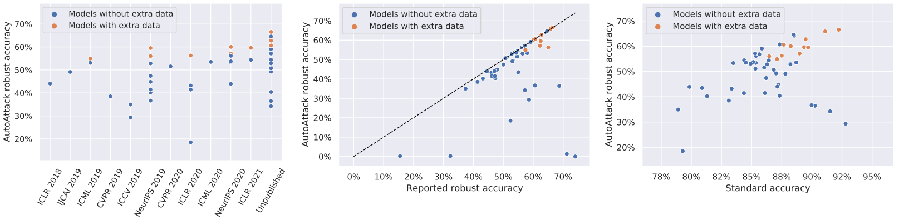

# RobustBench: a standardized adversarial robustness benchmark

**Francesco Croce\* (University of Tübingen), Maksym Andriushchenko\* (EPFL), Vikash Sehwag\* (Princeton University), Edoardo Debenedetti\* (EPFL),
Nicolas Flammarion (EPFL), Mung Chiang (Purdue University), Prateek Mittal (Princeton University), Matthias Hein (University of Tübingen)**

**Leaderboard**: [https://robustbench.github.io/](https://robustbench.github.io/)

**Paper:** [https://arxiv.org/abs/2010.09670](https://arxiv.org/abs/2010.09670)

**❗Note❗: if you experience problems with the automatic downloading of the models from Google Drive, install the latest version of `RobustBench` via `pip install git+https://github.com/RobustBench/robustbench.git`.**

<p align="center">
<p align="center">
<p align="center">

  
## News
- **May 2022**: We have extended the common corruptions leaderboard on ImageNet with [3D Common Corruptions](https://3dcommoncorruptions.epfl.ch/) (ImageNet-3DCC). ImageNet-3DCC evaluation is interesting since (1) it includes more realistic corruptions and (2) it can be used to assess generalization of the existing models which may have overfitted to ImageNet-C. For a quickstart, click [here](#new-evaluating-robustness-of-imagenet-models-against-3d-common-corruptions-imagenet-3dcc). Note that the entries in leaderboard are still sorted according to ImageNet-C performance.
  
- **May 2022**: We fixed the preprocessing issue for ImageNet corruption evaluations: previously we used resize to 256x256 and central crop to 224x224 which wasn't necessary since the ImageNet-C images are already 224x224 (see [this issue](https://github.com/RobustBench/robustbench/issues/59)). Note that this changed the ranking between the top-1 and top-2 entries.
  
  
## Main idea
  
The goal of **`RobustBench`** is to systematically track the *real* progress in adversarial robustness. 
There are already [more than 3'000 papers](https://nicholas.carlini.com/writing/2019/all-adversarial-example-papers.html) 
on this topic, but it is still often unclear which approaches really work and which only lead to [overestimated robustness](https://arxiv.org/abs/1802.00420).
We start from benchmarking the Linf, L2, and common corruption robustness since these are the most studied settings in the literature. 

Evaluation of the robustness to Lp perturbations *in general* is not straightforward and requires adaptive attacks ([Tramer et al., (2020)](https://arxiv.org/abs/2002.08347)).
Thus, in order to establish a reliable *standardized* benchmark, we need to impose some restrictions on the defenses we consider.
In particular, **we accept only defenses that are (1) have in general non-zero gradients wrt the inputs, (2) have a fully deterministic forward pass (i.e. no randomness) that
(3) does not have an optimization loop.** Often, defenses that violate these 3 principles only make gradient-based attacks 
harder but do not substantially improve robustness ([Carlini et al., (2019)](https://arxiv.org/abs/1902.06705)) except those
that can present concrete provable guarantees (e.g. [Cohen et al., (2019)](https://arxiv.org/abs/1902.02918)). 

To prevent potential overadaptation of new defenses to AutoAttack, we also welcome external evaluations based on **adaptive attacks**, especially where AutoAttack [flags](https://github.com/fra31/auto-attack/blob/master/flags_doc.md) a potential overestimation of robustness. For each model, we are interested in the best known robust accuracy and see AutoAttack and adaptive attacks as complementary to each other.

**`RobustBench`** consists of two parts: 
- a website [https://robustbench.github.io/](https://robustbench.github.io/) with the leaderboard based on many recent papers (plots below 👇)
- a collection of the most robust models, **Model Zoo**, which are easy to use for any downstream application (see the tutorial below after FAQ 👇)

<!-- <p align="center">  </p> -->
<!-- <p align="center">  </p> -->
<p align="center"></p>


## FAQ

**Q**: How does the RobustBench leaderboard differ from the [AutoAttack leaderboard](https://github.com/fra31/auto-attack)? 🤔 \
**A**: The [AutoAttack leaderboard](https://github.com/fra31/auto-attack) was the starting point of RobustBench. Now only the [RobustBench leaderboard](https://robustbench.github.io/) is actively maintained.

**Q**: How does the RobustBench leaderboard differ from [robust-ml.org](https://www.robust-ml.org/)? 🤔 \
**A**: [robust-ml.org](https://www.robust-ml.org/) focuses on *adaptive* evaluations, but we provide a **standardized benchmark**. Adaptive evaluations
have been very useful (e.g., see [Tramer et al., 2020](https://arxiv.org/abs/2002.08347)) but they are also very time-consuming and not standardized by definition. Instead, we argue that one can estimate robustness accurately mostly *without* adaptive attacks but for this one has to introduce some restrictions on the considered models. However, we do welcome adaptive evaluations and we are always interested in showing the best known robust accuracy.

**Q**: How is it related to libraries like `foolbox` / `cleverhans` / `advertorch`? 🤔 \
**A**: These libraries provide implementations of different *attacks*. Besides the standardized benchmark, **`RobustBench`** 
additionally provides a repository of the most robust models. So you can start using the
robust models in one line of code (see the tutorial below 👇).

**Q**: Why is Lp-robustness still interesting in 2021? 🤔 \
**A**: There are numerous interesting applications of Lp-robustness that span 
transfer learning ([Salman et al. (2020)](https://arxiv.org/abs/2007.08489), [Utrera et al. (2020)](https://arxiv.org/abs/2007.05869)), 
interpretability ([Tsipras et al. (2018)](https://arxiv.org/abs/1805.12152), [Kaur et al. (2019)](https://arxiv.org/abs/1910.08640), [Engstrom et al. (2019)](https://arxiv.org/abs/1906.00945)),
security ([Tramèr et al. (2018)](https://arxiv.org/abs/1811.03194), [Saadatpanah et al. (2019)](https://arxiv.org/abs/1906.07153)),
generalization ([Xie et al. (2019)](https://arxiv.org/abs/1911.09665), [Zhu et al. (2019)](https://arxiv.org/abs/1909.11764), [Bochkovskiy et al. (2020)](https://arxiv.org/abs/2004.10934)), 
robustness to unseen perturbations ([Xie et al. (2019)](https://arxiv.org/abs/1911.09665), [Kang et al. (2019)](https://arxiv.org/abs/1905.01034)),
stabilization of GAN training ([Zhong et al. (2020)](https://arxiv.org/abs/2008.03364)).

**Q**: What about verified adversarial robustness? 🤔 \
**A**: We mostly focus on defenses which improve empirical robustness, given the lack of clarity regarding 
which approaches really improve robustness and which only make some particular attacks unsuccessful.
However, we do not restrict submissions of verifiably robust models (e.g., we have [Zhang et al. (2019)](https://arxiv.org/abs/1906.06316) in our CIFAR-10 Linf leaderboard).
For methods targeting verified robustness, we encourage the readers to check out [Salman et al. (2019)](https://arxiv.org/abs/1902.08722) 
and [Li et al. (2020)](https://arxiv.org/abs/2009.04131).

**Q**: What if I have a better attack than the one used in this benchmark? 🤔 \
**A**: We will be happy to add a better attack or any adaptive evaluation that would complement our default standardized attacks.


## Model Zoo: quick tour

The goal of our **Model Zoo** is to simplify the usage of robust models as much as possible. Check
out our Colab notebook here
👉 [RobustBench: quick start](https://colab.research.google.com/drive/1MQY_7O9vj7ixD5ilVRbdQwlNPFvxifHV)
for a quick introduction. It is also summarized below 👇.

First, install the latest version of **`RobustBench`** (recommended):

```bash
pip install git+https://github.com/RobustBench/robustbench.git
```

or the latest *stable* version of **`RobustBench`** (it is possible that automatic downloading of the models may not work):

```bash
pip install git+https://github.com/RobustBench/robustbench.git@v1.0
```

Now let's try to load CIFAR-10 and some quite robust CIFAR-10 models from 
[Carmon2019Unlabeled](https://arxiv.org/abs/1905.13736) that achieves 59.53% robust accuracy evaluated with AA under 
`eps=8/255`:

```python
from robustbench.data import load_cifar10

x_test, y_test = load_cifar10(n_examples=50)

from robustbench.utils import load_model

model = load_model(model_name='Carmon2019Unlabeled', dataset='cifar10', threat_model='Linf')
```

Let's try to evaluate the robustness of this model. We can use any favourite library for this. For example, [FoolBox](https://github.com/bethgelab/foolbox)
implements many different attacks. We can start from a simple PGD attack:
```python
!pip install -q foolbox
import foolbox as fb
fmodel = fb.PyTorchModel(model, bounds=(0, 1))

_, advs, success = fb.attacks.LinfPGD()(fmodel, x_test.to('cuda:0'), y_test.to('cuda:0'), epsilons=[8/255])
print('Robust accuracy: {:.1%}'.format(1 - success.float().mean()))
```
```
>>> Robust accuracy: 58.0%
```
Wonderful! Can we do better with a more accurate attack?

Let's try to evaluate its robustness with a cheap version [AutoAttack](https://arxiv.org/abs/2003.01690) from ICML 2020 with 2/4 attacks (only APGD-CE and APGD-DLR):
```python
# autoattack is installed as a dependency of robustbench so there is not need to install it separately
from autoattack import AutoAttack
adversary = AutoAttack(model, norm='Linf', eps=8/255, version='custom', attacks_to_run=['apgd-ce', 'apgd-dlr'])
adversary.apgd.n_restarts = 1
x_adv = adversary.run_standard_evaluation(x_test, y_test)
```
```
>>> initial accuracy: 92.00%
>>> apgd-ce - 1/1 - 19 out of 46 successfully perturbed
>>> robust accuracy after APGD-CE: 54.00% (total time 10.3 s)
>>> apgd-dlr - 1/1 - 1 out of 27 successfully perturbed
>>> robust accuracy after APGD-DLR: 52.00% (total time 17.0 s)
>>> max Linf perturbation: 0.03137, nan in tensor: 0, max: 1.00000, min: 0.00000
>>> robust accuracy: 52.00%
```
Note that for our standardized evaluation of Linf-robustness we use the *full* version of AutoAttack which is slower but 
more accurate (for that just use `adversary = AutoAttack(model, norm='Linf', eps=8/255)`).

What about other types of perturbations? Is Lp-robustness useful there? We can evaluate the available models on more general perturbations. 
For example, let's take images corrupted by fog perturbations from CIFAR-10-C with the highest level of severity (5). 
Are different Linf robust models perform better on them?

```python
from robustbench.data import load_cifar10c
from robustbench.utils import clean_accuracy

corruptions = ['fog']
x_test, y_test = load_cifar10c(n_examples=1000, corruptions=corruptions, severity=5)

for model_name in ['Standard', 'Engstrom2019Robustness', 'Rice2020Overfitting',
                   'Carmon2019Unlabeled']:
 model = load_model(model_name, dataset='cifar10', threat_model='Linf')
 acc = clean_accuracy(model, x_test, y_test)
 print(f'Model: {model_name}, CIFAR-10-C accuracy: {acc:.1%}')
``` 
```
>>> Model: Standard, CIFAR-10-C accuracy: 74.4%
>>> Model: Engstrom2019Robustness, CIFAR-10-C accuracy: 38.8%
>>> Model: Rice2020Overfitting, CIFAR-10-C accuracy: 22.0%
>>> Model: Carmon2019Unlabeled, CIFAR-10-C accuracy: 31.1%
```
As we can see, **all** these Linf robust models perform considerably worse than the standard model on this type of corruptions. 
This curious phenomenon was first noticed in [Adversarial Examples Are a Natural Consequence of Test Error in Noise](https://arxiv.org/abs/1901.10513) 
and explained from the frequency perspective in [A Fourier Perspective on Model Robustness in Computer Vision](https://arxiv.org/abs/1906.08988). 

However, on average adversarial training *does* help on CIFAR-10-C. One can check this easily by loading all types of corruptions 
via `load_cifar10c(n_examples=1000, severity=5)`, and repeating evaluation on them.


### **\*New\***: Evaluating robustness of ImageNet models against 3D Common Corruptions (ImageNet-3DCC)

3D Common Corruptions (3DCC) is a recent benchmark by [Kar et al. (CVPR 2022)](https://3dcommoncorruptions.epfl.ch/) using scene geometry to generate realistic corruptions. You can evaluate robustness of a standard ResNet-50 against ImageNet-3DCC by following these steps:

1. Download the data from [here](https://github.com/EPFL-VILAB/3DCommonCorruptions#3dcc-data) using the provided tool. The data will be saved into a folder named `ImageNet-3DCC`.

2. Run the sample evaluation script to obtain accuracies and save them in a pickle file:
```python
import torch 
from robustbench.data import load_imagenet3dcc
from robustbench.utils import clean_accuracy, load_model

corruptions_3dcc = ['near_focus', 'far_focus', 'bit_error', 'color_quant', 
                   'flash', 'fog_3d', 'h265_abr', 'h265_crf',
                   'iso_noise', 'low_light', 'xy_motion_blur', 'z_motion_blur'] # 12 corruptions in ImageNet-3DCC

device = torch.device("cuda:0")
model = load_model('Standard_R50', dataset='imagenet', threat_model='corruptions').to(device)
for corruption in corruptions_3dcc:
    for s in [1, 2, 3, 4, 5]:  # 5 severity levels
        x_test, y_test = load_imagenet3dcc(n_examples=5000, corruptions=[corruption], severity=s, data_dir=$PATH_IMAGENET_3DCC)
        acc = clean_accuracy(model, x_test.to(device), y_test.to(device), device=device)
        print(f'Model: {model_name}, ImageNet-3DCC corruption: {corruption} severity: {s} accuracy: {acc:.1%}')
```


## Model Zoo
In order to use a model, you just need to know its ID, e.g. **Carmon2019Unlabeled**, and to run:

```python
from robustbench import load_model

model = load_model(model_name='Carmon2019Unlabeled', dataset='cifar10', threat_model='Linf')
```
which automatically downloads the model (all models are defined in `model_zoo/models.py`).

Reproducing evaluation of models from the Model Zoo can be done directly from the command line. Here is an example of 
an evaluation of `Salman2020Do_R18` model with AutoAttack on ImageNet for `eps=4/255=0.0156862745`:
```python
python -m robustbench.eval --n_ex=5000 --dataset=imagenet --threat_model=Linf --model_name=Salman2020Do_R18 --data_dir=/tmldata1/andriush/imagenet --batch_size=128 --eps=0.0156862745
```
The CIFAR-10, CIFAR-10-C, CIFAR-100, and CIFAR-100-C datasets are downloaded automatically. However, the ImageNet datasets should be downloaded manually due to their licensing:
- ImageNet: Obtain the download link [here](https://image-net.org/download.php) 
(requires just signing up from an academic email, the approval system there is automatic and happens instantly) and then follow
the instructions [here](https://github.com/soumith/imagenet-multiGPU.torch#data-processing) to extract the validation 
set in a pytorch-compatible format into folder `val`.
- ImageNet-C: Please visit [here](https://github.com/hendrycks/robustness#imagenet-c) for the instructions.
- ImageNet-3DCC: Download the data from [here](https://github.com/EPFL-VILAB/3DCommonCorruptions#3dcc-data) using the provided tool. The data will be saved into a folder named `ImageNet-3DCC`.

In order to use the models from the Model Zoo, you can find all available model IDs in the tables below. Note that the full [leaderboard](https://robustbench.github.io/) contains a bit more models which we either have not yet added to the Model Zoo or their authors don't want them to appear in the Model Zoo.


### CIFAR-10

#### Linf, eps=8/255
| <sub>#</sub> | <sub>Model ID</sub> | <sub>Paper</sub> | <sub>Clean accuracy</sub> | <sub>Robust accuracy</sub> | <sub>Architecture</sub> | <sub>Venue</sub> |
|:---:|---|---|:---:|:---:|:---:|:---:|
| <sub>**1**</sub> | <sub><sup>**Wang2023Better_WRN-70-16**</sup></sub> | <sub>*[Better Diffusion Models Further Improve Adversarial Training](https://arxiv.org/abs/2302.04638)*</sub> | <sub>93.25%</sub> | <sub>70.69%</sub> | <sub>WideResNet-70-16</sub> | <sub>arXiv, Feb 2023</sub> |
| <sub>**2**</sub> | <sub><sup>**Wang2023Better_WRN-28-10**</sup></sub> | <sub>*[Better Diffusion Models Further Improve Adversarial Training](https://arxiv.org/abs/2302.04638)*</sub> | <sub>92.44%</sub> | <sub>67.31%</sub> | <sub>WideResNet-28-10</sub> | <sub>arXiv, Feb 2023</sub> |
| <sub>**3**</sub> | <sub><sup>**Rebuffi2021Fixing_70_16_cutmix_extra**</sup></sub> | <sub>*[Fixing Data Augmentation to Improve Adversarial Robustness](https://arxiv.org/abs/2103.01946)*</sub> | <sub>92.23%</sub> | <sub>66.56%</sub> | <sub>WideResNet-70-16</sub> | <sub>arXiv, Mar 2021</sub> |
| <sub>**4**</sub> | <sub><sup>**Gowal2021Improving_70_16_ddpm_100m**</sup></sub> | <sub>*[Improving Robustness using Generated Data](https://arxiv.org/abs/2110.09468)*</sub> | <sub>88.74%</sub> | <sub>66.10%</sub> | <sub>WideResNet-70-16</sub> | <sub>NeurIPS 2021</sub> |
| <sub>**5**</sub> | <sub><sup>**Gowal2020Uncovering_70_16_extra**</sup></sub> | <sub>*[Uncovering the Limits of Adversarial Training against Norm-Bounded Adversarial Examples](https://arxiv.org/abs/2010.03593)*</sub> | <sub>91.10%</sub> | <sub>65.87%</sub> | <sub>WideResNet-70-16</sub> | <sub>arXiv, Oct 2020</sub> |
| <sub>**6**</sub> | <sub><sup>**Huang2022Revisiting_WRN-A4**</sup></sub> | <sub>*[Revisiting Residual Networks for Adversarial Robustness: An Architectural Perspective](https://arxiv.org/abs/2212.11005)*</sub> | <sub>91.58%</sub> | <sub>65.79%</sub> | <sub>WideResNet-A4</sub> | <sub>arXiv, Dec. 2022</sub> |
| <sub>**7**</sub> | <sub><sup>**Rebuffi2021Fixing_106_16_cutmix_ddpm**</sup></sub> | <sub>*[Fixing Data Augmentation to Improve Adversarial Robustness](https://arxiv.org/abs/2103.01946)*</sub> | <sub>88.50%</sub> | <sub>64.58%</sub> | <sub>WideResNet-106-16</sub> | <sub>arXiv, Mar 2021</sub> |
| <sub>**8**</sub> | <sub><sup>**Rebuffi2021Fixing_70_16_cutmix_ddpm**</sup></sub> | <sub>*[Fixing Data Augmentation to Improve Adversarial Robustness](https://arxiv.org/abs/2103.01946)*</sub> | <sub>88.54%</sub> | <sub>64.20%</sub> | <sub>WideResNet-70-16</sub> | <sub>arXiv, Mar 2021</sub> |
| <sub>**9**</sub> | <sub><sup>**Kang2021Stable**</sup></sub> | <sub>*[Stable Neural ODE with Lyapunov-Stable Equilibrium Points for Defending Against Adversarial Attacks](https://arxiv.org/abs/2110.12976)*</sub> | <sub>93.73%</sub> | <sub>64.20%</sub> | <sub>WideResNet-70-16, Neural ODE block</sub> | <sub>NeurIPS 2021</sub> |
| <sub>**10**</sub> | <sub><sup>**Gowal2021Improving_28_10_ddpm_100m**</sup></sub> | <sub>*[Improving Robustness using Generated Data](https://arxiv.org/abs/2110.09468)*</sub> | <sub>87.50%</sub> | <sub>63.38%</sub> | <sub>WideResNet-28-10</sub> | <sub>NeurIPS 2021</sub> |
| <sub>**11**</sub> | <sub><sup>**Pang2022Robustness_WRN70_16**</sup></sub> | <sub>*[ Robustness and Accuracy Could Be Reconcilable by (Proper) Definition](https://arxiv.org/pdf/2202.10103.pdf)*</sub> | <sub>89.01%</sub> | <sub>63.35%</sub> | <sub>WideResNet-70-16</sub> | <sub>ICML 2022</sub> |
| <sub>**12**</sub> | <sub><sup>**Rade2021Helper_extra**</sup></sub> | <sub>*[Helper-based Adversarial Training: Reducing Excessive Margin to Achieve a Better Accuracy vs. Robustness Trade-off](https://openreview.net/forum?id=BuD2LmNaU3a)*</sub> | <sub>91.47%</sub> | <sub>62.83%</sub> | <sub>WideResNet-34-10</sub> | <sub>OpenReview, Jun 2021</sub> |
| <sub>**13**</sub> | <sub><sup>**Sehwag2021Proxy_ResNest152**</sup></sub> | <sub>*[Robust Learning Meets Generative Models: Can Proxy Distributions Improve Adversarial Robustness?](https://arxiv.org/abs/2104.09425)*</sub> | <sub>87.30%</sub> | <sub>62.79%</sub> | <sub>ResNest152</sub> | <sub>ICLR 2022</sub> |
| <sub>**14**</sub> | <sub><sup>**Gowal2020Uncovering_28_10_extra**</sup></sub> | <sub>*[Uncovering the Limits of Adversarial Training against Norm-Bounded Adversarial Examples](https://arxiv.org/abs/2010.03593)*</sub> | <sub>89.48%</sub> | <sub>62.76%</sub> | <sub>WideResNet-28-10</sub> | <sub>arXiv, Oct 2020</sub> |
| <sub>**15**</sub> | <sub><sup>**Huang2021Exploring_ema**</sup></sub> | <sub>*[Exploring Architectural Ingredients of Adversarially Robust Deep Neural Networks](https://arxiv.org/abs/2110.03825)*</sub> | <sub>91.23%</sub> | <sub>62.54%</sub> | <sub>WideResNet-34-R</sub> | <sub>NeurIPS 2021</sub> |
| <sub>**16**</sub> | <sub><sup>**Huang2021Exploring**</sup></sub> | <sub>*[Exploring Architectural Ingredients of Adversarially Robust Deep Neural Networks](https://arxiv.org/abs/2110.03825)*</sub> | <sub>90.56%</sub> | <sub>61.56%</sub> | <sub>WideResNet-34-R</sub> | <sub>NeurIPS 2021</sub> |
| <sub>**17**</sub> | <sub><sup>**Dai2021Parameterizing**</sup></sub> | <sub>*[Parameterizing Activation Functions for Adversarial Robustness](https://arxiv.org/abs/2110.05626)*</sub> | <sub>87.02%</sub> | <sub>61.55%</sub> | <sub>WideResNet-28-10-PSSiLU</sub> | <sub>arXiv, Oct 2021</sub> |
| <sub>**18**</sub> | <sub><sup>**Pang2022Robustness_WRN28_10**</sup></sub> | <sub>*[ Robustness and Accuracy Could Be Reconcilable by (Proper) Definition](https://arxiv.org/pdf/2202.10103.pdf)*</sub> | <sub>88.61%</sub> | <sub>61.04%</sub> | <sub>WideResNet-28-10</sub> | <sub>ICML 2022</sub> |
| <sub>**19**</sub> | <sub><sup>**Rade2021Helper_ddpm**</sup></sub> | <sub>*[Helper-based Adversarial Training: Reducing Excessive Margin to Achieve a Better Accuracy vs. Robustness Trade-off](https://openreview.net/forum?id=BuD2LmNaU3a)*</sub> | <sub>88.16%</sub> | <sub>60.97%</sub> | <sub>WideResNet-28-10</sub> | <sub>OpenReview, Jun 2021</sub> |
| <sub>**20**</sub> | <sub><sup>**Rebuffi2021Fixing_28_10_cutmix_ddpm**</sup></sub> | <sub>*[Fixing Data Augmentation to Improve Adversarial Robustness](https://arxiv.org/abs/2103.01946)*</sub> | <sub>87.33%</sub> | <sub>60.73%</sub> | <sub>WideResNet-28-10</sub> | <sub>arXiv, Mar 2021</sub> |
| <sub>**21**</sub> | <sub><sup>**Sridhar2021Robust_34_15**</sup></sub> | <sub>*[Improving Neural Network Robustness via Persistency of Excitation](https://arxiv.org/abs/2106.02078)*</sub> | <sub>86.53%</sub> | <sub>60.41%</sub> | <sub>WideResNet-34-15</sub> | <sub>ACC 2022</sub> |
| <sub>**22**</sub> | <sub><sup>**Sehwag2021Proxy**</sup></sub> | <sub>*[Robust Learning Meets Generative Models: Can Proxy Distributions Improve Adversarial Robustness?](https://arxiv.org/abs/2104.09425)*</sub> | <sub>86.68%</sub> | <sub>60.27%</sub> | <sub>WideResNet-34-10</sub> | <sub>ICLR 2022</sub> |
| <sub>**23**</sub> | <sub><sup>**Wu2020Adversarial_extra**</sup></sub> | <sub>*[Adversarial Weight Perturbation Helps Robust Generalization](https://arxiv.org/abs/2004.05884)*</sub> | <sub>88.25%</sub> | <sub>60.04%</sub> | <sub>WideResNet-28-10</sub> | <sub>NeurIPS 2020</sub> |
| <sub>**24**</sub> | <sub><sup>**Sridhar2021Robust**</sup></sub> | <sub>*[Improving Neural Network Robustness via Persistency of Excitation](https://arxiv.org/abs/2106.02078)*</sub> | <sub>89.46%</sub> | <sub>59.66%</sub> | <sub>WideResNet-28-10</sub> | <sub>ACC 2022</sub> |
| <sub>**25**</sub> | <sub><sup>**Zhang2020Geometry**</sup></sub> | <sub>*[Geometry-aware Instance-reweighted Adversarial Training](https://arxiv.org/abs/2010.01736)*</sub> | <sub>89.36%</sub> | <sub>59.64%</sub> | <sub>WideResNet-28-10</sub> | <sub>ICLR 2021</sub> |
| <sub>**26**</sub> | <sub><sup>**Carmon2019Unlabeled**</sup></sub> | <sub>*[Unlabeled Data Improves Adversarial Robustness](https://arxiv.org/abs/1905.13736)*</sub> | <sub>89.69%</sub> | <sub>59.53%</sub> | <sub>WideResNet-28-10</sub> | <sub>NeurIPS 2019</sub> |
| <sub>**27**</sub> | <sub><sup>**Gowal2021Improving_R18_ddpm_100m**</sup></sub> | <sub>*[Improving Robustness using Generated Data](https://arxiv.org/abs/2110.09468)*</sub> | <sub>87.35%</sub> | <sub>58.50%</sub> | <sub>PreActResNet-18</sub> | <sub>NeurIPS 2021</sub> |
| <sub>**28**</sub> | <sub><sup>**Addepalli2021Towards_WRN34**</sup></sub> | <sub>*[Towards Achieving Adversarial Robustness Beyond Perceptual Limits](https://openreview.net/forum?id=SHB_znlW5G7)*</sub> | <sub>85.32%</sub> | <sub>58.04%</sub> | <sub>WideResNet-34-10</sub> | <sub>OpenReview, Jun 2021</sub> |
| <sub>**29**</sub> | <sub><sup>**Addepalli2022Efficient_WRN_34_10**</sup></sub> | <sub>*[Efficient and Effective Augmentation Strategy for Adversarial Training](https://artofrobust.github.io/short_paper/31.pdf)*</sub> | <sub>88.71%</sub> | <sub>57.81%</sub> | <sub>WideResNet-34-10</sub> | <sub>CVPRW 2022</sub> |
| <sub>**30**</sub> | <sub><sup>**Chen2021LTD_WRN34_20**</sup></sub> | <sub>*[LTD: Low Temperature Distillation for Robust Adversarial Training](https://arxiv.org/abs/2111.02331)*</sub> | <sub>86.03%</sub> | <sub>57.71%</sub> | <sub>WideResNet-34-20</sub> | <sub>arXiv, Nov 2021</sub> |
| <sub>**31**</sub> | <sub><sup>**Rade2021Helper_R18_extra**</sup></sub> | <sub>*[Helper-based Adversarial Training: Reducing Excessive Margin to Achieve a Better Accuracy vs. Robustness Trade-off](https://openreview.net/forum?id=BuD2LmNaU3a)*</sub> | <sub>89.02%</sub> | <sub>57.67%</sub> | <sub>PreActResNet-18</sub> | <sub>OpenReview, Jun 2021</sub> |
| <sub>**32**</sub> | <sub><sup>**Jia2022LAS-AT_70_16**</sup></sub> | <sub>*[LAS-AT: Adversarial Training with Learnable Attack Strategy](https://arxiv.org/abs/2203.06616)*</sub> | <sub>85.66%</sub> | <sub>57.61%</sub> | <sub>WideResNet-70-16</sub> | <sub>arXiv, Mar 2022</sub> |
| <sub>**33**</sub> | <sub><sup>**Debenedetti2022Light_XCiT-L12**</sup></sub> | <sub>*[A Light Recipe to Train Robust Vision Transformers](https://arxiv.org/abs/2209.07399)*</sub> | <sub>91.73%</sub> | <sub>57.58%</sub> | <sub>XCiT-L12</sub> | <sub>arXiv, Sep 2022</sub> |
| <sub>**34**</sub> | <sub><sup>**Debenedetti2022Light_XCiT-M12**</sup></sub> | <sub>*[A Light Recipe to Train Robust Vision Transformers](https://arxiv.org/abs/2209.07399)*</sub> | <sub>91.30%</sub> | <sub>57.27%</sub> | <sub>XCiT-M12</sub> | <sub>arXiv, Sep 2022</sub> |
| <sub>**35**</sub> | <sub><sup>**Sehwag2020Hydra**</sup></sub> | <sub>*[HYDRA: Pruning Adversarially Robust Neural Networks](https://arxiv.org/abs/2002.10509)*</sub> | <sub>88.98%</sub> | <sub>57.14%</sub> | <sub>WideResNet-28-10</sub> | <sub>NeurIPS 2020</sub> |
| <sub>**36**</sub> | <sub><sup>**Gowal2020Uncovering_70_16**</sup></sub> | <sub>*[Uncovering the Limits of Adversarial Training against Norm-Bounded Adversarial Examples](https://arxiv.org/abs/2010.03593)*</sub> | <sub>85.29%</sub> | <sub>57.14%</sub> | <sub>WideResNet-70-16</sub> | <sub>arXiv, Oct 2020</sub> |
| <sub>**37**</sub> | <sub><sup>**Rade2021Helper_R18_ddpm**</sup></sub> | <sub>*[Helper-based Adversarial Training: Reducing Excessive Margin to Achieve a Better Accuracy vs. Robustness Trade-off](https://openreview.net/forum?id=BuD2LmNaU3a)*</sub> | <sub>86.86%</sub> | <sub>57.09%</sub> | <sub>PreActResNet-18</sub> | <sub>OpenReview, Jun 2021</sub> |
| <sub>**38**</sub> | <sub><sup>**Chen2021LTD_WRN34_10**</sup></sub> | <sub>*[LTD: Low Temperature Distillation for Robust Adversarial Training](https://arxiv.org/abs/2111.02331)*</sub> | <sub>85.21%</sub> | <sub>56.94%</sub> | <sub>WideResNet-34-10</sub> | <sub>arXiv, Nov 2021</sub> |
| <sub>**39**</sub> | <sub><sup>**Gowal2020Uncovering_34_20**</sup></sub> | <sub>*[Uncovering the Limits of Adversarial Training against Norm-Bounded Adversarial Examples](https://arxiv.org/abs/2010.03593)*</sub> | <sub>85.64%</sub> | <sub>56.82%</sub> | <sub>WideResNet-34-20</sub> | <sub>arXiv, Oct 2020</sub> |
| <sub>**40**</sub> | <sub><sup>**Rebuffi2021Fixing_R18_ddpm**</sup></sub> | <sub>*[Fixing Data Augmentation to Improve Adversarial Robustness](https://arxiv.org/abs/2103.01946)*</sub> | <sub>83.53%</sub> | <sub>56.66%</sub> | <sub>PreActResNet-18</sub> | <sub>arXiv, Mar 2021</sub> |
| <sub>**41**</sub> | <sub><sup>**Wang2020Improving**</sup></sub> | <sub>*[Improving Adversarial Robustness Requires Revisiting Misclassified Examples](https://openreview.net/forum?id=rklOg6EFwS)*</sub> | <sub>87.50%</sub> | <sub>56.29%</sub> | <sub>WideResNet-28-10</sub> | <sub>ICLR 2020</sub> |
| <sub>**42**</sub> | <sub><sup>**Jia2022LAS-AT_34_10**</sup></sub> | <sub>*[LAS-AT: Adversarial Training with Learnable Attack Strategy](https://arxiv.org/abs/2203.06616)*</sub> | <sub>84.98%</sub> | <sub>56.26%</sub> | <sub>WideResNet-34-10</sub> | <sub>arXiv, Mar 2022</sub> |
| <sub>**43**</sub> | <sub><sup>**Wu2020Adversarial**</sup></sub> | <sub>*[Adversarial Weight Perturbation Helps Robust Generalization](https://arxiv.org/abs/2004.05884)*</sub> | <sub>85.36%</sub> | <sub>56.17%</sub> | <sub>WideResNet-34-10</sub> | <sub>NeurIPS 2020</sub> |
| <sub>**44**</sub> | <sub><sup>**Debenedetti2022Light_XCiT-S12**</sup></sub> | <sub>*[A Light Recipe to Train Robust Vision Transformers](https://arxiv.org/abs/2209.07399)*</sub> | <sub>90.06%</sub> | <sub>56.14%</sub> | <sub>XCiT-S12</sub> | <sub>arXiv, Sep 2022</sub> |
| <sub>**45**</sub> | <sub><sup>**Sehwag2021Proxy_R18**</sup></sub> | <sub>*[Robust Learning Meets Generative Models: Can Proxy Distributions Improve Adversarial Robustness?](https://arxiv.org/abs/2104.09425)*</sub> | <sub>84.59%</sub> | <sub>55.54%</sub> | <sub>ResNet-18</sub> | <sub>ICLR 2022</sub> |
| <sub>**46**</sub> | <sub><sup>**Hendrycks2019Using**</sup></sub> | <sub>*[Using Pre-Training Can Improve Model Robustness and Uncertainty](https://arxiv.org/abs/1901.09960)*</sub> | <sub>87.11%</sub> | <sub>54.92%</sub> | <sub>WideResNet-28-10</sub> | <sub>ICML 2019</sub> |
| <sub>**47**</sub> | <sub><sup>**Pang2020Boosting**</sup></sub> | <sub>*[Boosting Adversarial Training with Hypersphere Embedding](https://arxiv.org/abs/2002.08619)*</sub> | <sub>85.14%</sub> | <sub>53.74%</sub> | <sub>WideResNet-34-20</sub> | <sub>NeurIPS 2020</sub> |
| <sub>**48**</sub> | <sub><sup>**Cui2020Learnable_34_20**</sup></sub> | <sub>*[Learnable Boundary Guided Adversarial Training](https://arxiv.org/abs/2011.11164)*</sub> | <sub>88.70%</sub> | <sub>53.57%</sub> | <sub>WideResNet-34-20</sub> | <sub>ICCV 2021</sub> |
| <sub>**49**</sub> | <sub><sup>**Zhang2020Attacks**</sup></sub> | <sub>*[Attacks Which Do Not Kill Training Make Adversarial Learning Stronger](https://arxiv.org/abs/2002.11242)*</sub> | <sub>84.52%</sub> | <sub>53.51%</sub> | <sub>WideResNet-34-10</sub> | <sub>ICML 2020</sub> |
| <sub>**50**</sub> | <sub><sup>**Rice2020Overfitting**</sup></sub> | <sub>*[Overfitting in adversarially robust deep learning](https://arxiv.org/abs/2002.11569)*</sub> | <sub>85.34%</sub> | <sub>53.42%</sub> | <sub>WideResNet-34-20</sub> | <sub>ICML 2020</sub> |
| <sub>**51**</sub> | <sub><sup>**Huang2020Self**</sup></sub> | <sub>*[Self-Adaptive Training: beyond Empirical Risk Minimization](https://arxiv.org/abs/2002.10319)*</sub> | <sub>83.48%</sub> | <sub>53.34%</sub> | <sub>WideResNet-34-10</sub> | <sub>NeurIPS 2020</sub> |
| <sub>**52**</sub> | <sub><sup>**Zhang2019Theoretically**</sup></sub> | <sub>*[Theoretically Principled Trade-off between Robustness and Accuracy](https://arxiv.org/abs/1901.08573)*</sub> | <sub>84.92%</sub> | <sub>53.08%</sub> | <sub>WideResNet-34-10</sub> | <sub>ICML 2019</sub> |
| <sub>**53**</sub> | <sub><sup>**Cui2020Learnable_34_10**</sup></sub> | <sub>*[Learnable Boundary Guided Adversarial Training](https://arxiv.org/abs/2011.11164)*</sub> | <sub>88.22%</sub> | <sub>52.86%</sub> | <sub>WideResNet-34-10</sub> | <sub>ICCV 2021</sub> |
| <sub>**54**</sub> | <sub><sup>**Addepalli2022Efficient_RN18**</sup></sub> | <sub>*[Efficient and Effective Augmentation Strategy for Adversarial Training](https://artofrobust.github.io/short_paper/31.pdf)*</sub> | <sub>85.71%</sub> | <sub>52.48%</sub> | <sub>ResNet-18</sub> | <sub>CVPRW 2022</sub> |
| <sub>**55**</sub> | <sub><sup>**Chen2020Adversarial**</sup></sub> | <sub>*[Adversarial Robustness: From Self-Supervised Pre-Training to Fine-Tuning](https://arxiv.org/abs/2003.12862)*</sub> | <sub>86.04%</sub> | <sub>51.56%</sub> | <sub>ResNet-50 <br/> (3x ensemble)</sub> | <sub>CVPR 2020</sub> |
| <sub>**56**</sub> | <sub><sup>**Chen2020Efficient**</sup></sub> | <sub>*[Efficient Robust Training via Backward Smoothing](https://arxiv.org/abs/2010.01278)*</sub> | <sub>85.32%</sub> | <sub>51.12%</sub> | <sub>WideResNet-34-10</sub> | <sub>arXiv, Oct 2020</sub> |
| <sub>**57**</sub> | <sub><sup>**Addepalli2021Towards_RN18**</sup></sub> | <sub>*[Towards Achieving Adversarial Robustness Beyond Perceptual Limits](https://openreview.net/forum?id=SHB_znlW5G7)*</sub> | <sub>80.24%</sub> | <sub>51.06%</sub> | <sub>ResNet-18</sub> | <sub>OpenReview, Jun 2021</sub> |
| <sub>**58**</sub> | <sub><sup>**Sitawarin2020Improving**</sup></sub> | <sub>*[Improving Adversarial Robustness Through Progressive Hardening](https://arxiv.org/abs/2003.09347)*</sub> | <sub>86.84%</sub> | <sub>50.72%</sub> | <sub>WideResNet-34-10</sub> | <sub>arXiv, Mar 2020</sub> |
| <sub>**59**</sub> | <sub><sup>**Engstrom2019Robustness**</sup></sub> | <sub>*[Robustness library](https://github.com/MadryLab/robustness)*</sub> | <sub>87.03%</sub> | <sub>49.25%</sub> | <sub>ResNet-50</sub> | <sub>GitHub,<br>Oct 2019</sub> |
| <sub>**60**</sub> | <sub><sup>**Zhang2019You**</sup></sub> | <sub>*[You Only Propagate Once: Accelerating Adversarial Training via Maximal Principle](https://arxiv.org/abs/1905.00877)*</sub> | <sub>87.20%</sub> | <sub>44.83%</sub> | <sub>WideResNet-34-10</sub> | <sub>NeurIPS 2019</sub> |
| <sub>**61**</sub> | <sub><sup>**Andriushchenko2020Understanding**</sup></sub> | <sub>*[Understanding and Improving Fast Adversarial Training](https://arxiv.org/abs/2007.02617)*</sub> | <sub>79.84%</sub> | <sub>43.93%</sub> | <sub>PreActResNet-18</sub> | <sub>NeurIPS 2020</sub> |
| <sub>**62**</sub> | <sub><sup>**Wong2020Fast**</sup></sub> | <sub>*[Fast is better than free: Revisiting adversarial training](https://arxiv.org/abs/2001.03994)*</sub> | <sub>83.34%</sub> | <sub>43.21%</sub> | <sub>PreActResNet-18</sub> | <sub>ICLR 2020</sub> |
| <sub>**63**</sub> | <sub><sup>**Ding2020MMA**</sup></sub> | <sub>*[MMA Training: Direct Input Space Margin Maximization through Adversarial Training](https://openreview.net/forum?id=HkeryxBtPB)*</sub> | <sub>84.36%</sub> | <sub>41.44%</sub> | <sub>WideResNet-28-4</sub> | <sub>ICLR 2020</sub> |
| <sub>**64**</sub> | <sub><sup>**Standard**</sup></sub> | <sub>*[Standardly trained model](https://github.com/RobustBench/robustbench/)*</sub> | <sub>94.78%</sub> | <sub>0.00%</sub> | <sub>WideResNet-28-10</sub> | <sub>N/A</sub> |


#### L2, eps=0.5

|   <sub>#</sub>    | <sub>Model ID</sub>                                            | <sub>Paper</sub>                                                                                                                                                               | <sub>Clean accuracy</sub> | <sub>Robust accuracy</sub> |   <sub>Architecture</sub>   |        <sub>Venue</sub>         |
| :---------------: | -------------------------------------------------------------- | ------------------------------------------------------------------------------------------------------------------------------------------------------------------------------ | :-----------------------: | :------------------------: | :-------------------------: | :-----------------------------: |
| <sub>**1**</sub>  | <sub><sup>**Wang2023Better_WRN-70-16**</sup></sub> | <sub>*[Better Diffusion Models Further Improve Adversarial Training](https://arxiv.org/abs/2302.04638)*</sub> | <sub>95.54%</sub> | <sub>84.97%</sub> | <sub>WideResNet-70-16</sub> | <sub>arXiv, Feb 2023</sub> |
| <sub>**2**</sub> | <sub><sup>**Wang2023Better_WRN-28-10**</sup></sub> | <sub>*[Better Diffusion Models Further Improve Adversarial Training](https://arxiv.org/abs/2302.04638)*</sub> | <sub>95.16%</sub> | <sub>83.68%</sub> | <sub>WideResNet-28-10</sub> | <sub>arXiv, Feb 2023</sub> |
| <sub>**3**</sub> | <sub><sup>**Rebuffi2021Fixing_70_16_cutmix_extra**</sup></sub> | <sub>*[Fixing Data Augmentation to Improve Adversarial Robustness](https://arxiv.org/abs/2103.01946)*</sub> | <sub>95.74%</sub> | <sub>82.32%</sub> | <sub>WideResNet-70-16</sub> | <sub>arXiv, Mar 2021</sub> |
| <sub>**4**</sub> | <sub><sup>**Gowal2020Uncovering_extra**</sup></sub> | <sub>*[Uncovering the Limits of Adversarial Training against Norm-Bounded Adversarial Examples](https://arxiv.org/abs/2010.03593)*</sub> | <sub>94.74%</sub> | <sub>80.53%</sub> | <sub>WideResNet-70-16</sub> | <sub>arXiv, Oct 2020</sub> |
| <sub>**5**</sub> | <sub><sup>**Rebuffi2021Fixing_70_16_cutmix_ddpm**</sup></sub> | <sub>*[Fixing Data Augmentation to Improve Adversarial Robustness](https://arxiv.org/abs/2103.01946)*</sub> | <sub>92.41%</sub> | <sub>80.42%</sub> | <sub>WideResNet-70-16</sub> | <sub>arXiv, Mar 2021</sub> |
| <sub>**6**</sub> | <sub><sup>**Rebuffi2021Fixing_28_10_cutmix_ddpm**</sup></sub> | <sub>*[Fixing Data Augmentation to Improve Adversarial Robustness](https://arxiv.org/abs/2103.01946)*</sub> | <sub>91.79%</sub> | <sub>78.80%</sub> | <sub>WideResNet-28-10</sub> | <sub>arXiv, Mar 2021</sub> |
| <sub>**7**</sub> | <sub><sup>**Augustin2020Adversarial_34_10_extra**</sup></sub> | <sub>*[Adversarial Robustness on In- and Out-Distribution Improves Explainability](https://arxiv.org/abs/2003.09461)*</sub> | <sub>93.96%</sub> | <sub>78.79%</sub> | <sub>WideResNet-34-10</sub> | <sub>ECCV 2020</sub> |
| <sub>**8**</sub> | <sub><sup>**Sehwag2021Proxy**</sup></sub> | <sub>*[Robust Learning Meets Generative Models: Can Proxy Distributions Improve Adversarial Robustness?](https://arxiv.org/abs/2104.09425)*</sub> | <sub>90.93%</sub> | <sub>77.24%</sub> | <sub>WideResNet-34-10</sub> | <sub>ICLR 2022</sub> |
| <sub>**9**</sub> | <sub><sup>**Augustin2020Adversarial_34_10**</sup></sub> | <sub>*[Adversarial Robustness on In- and Out-Distribution Improves Explainability](https://arxiv.org/abs/2003.09461)*</sub> | <sub>92.23%</sub> | <sub>76.25%</sub> | <sub>WideResNet-34-10</sub> | <sub>ECCV 2020</sub> |
| <sub>**10**</sub> | <sub><sup>**Rade2021Helper_R18_ddpm**</sup></sub> | <sub>*[Helper-based Adversarial Training: Reducing Excessive Margin to Achieve a Better Accuracy vs. Robustness Trade-off](https://openreview.net/forum?id=BuD2LmNaU3a)*</sub> | <sub>90.57%</sub> | <sub>76.15%</sub> | <sub>PreActResNet-18</sub> | <sub>OpenReview, Jun 2021</sub> |
| <sub>**11**</sub> | <sub><sup>**Rebuffi2021Fixing_R18_cutmix_ddpm**</sup></sub> | <sub>*[Fixing Data Augmentation to Improve Adversarial Robustness](https://arxiv.org/abs/2103.01946)*</sub> | <sub>90.33%</sub> | <sub>75.86%</sub> | <sub>PreActResNet-18</sub> | <sub>arXiv, Mar 2021</sub> |
| <sub>**12**</sub> | <sub><sup>**Gowal2020Uncovering**</sup></sub> | <sub>*[Uncovering the Limits of Adversarial Training against Norm-Bounded Adversarial Examples](https://arxiv.org/abs/2010.03593)*</sub> | <sub>90.90%</sub> | <sub>74.50%</sub> | <sub>WideResNet-70-16</sub> | <sub>arXiv, Oct 2020</sub> |
| <sub>**13**</sub> | <sub><sup>**Sehwag2021Proxy_R18**</sup></sub> | <sub>*[Robust Learning Meets Generative Models: Can Proxy Distributions Improve Adversarial Robustness?](https://arxiv.org/abs/2104.09425)*</sub> | <sub>89.76%</sub> | <sub>74.41%</sub> | <sub>ResNet-18</sub> | <sub>ICLR 2022</sub> |
| <sub>**14**</sub> | <sub><sup>**Wu2020Adversarial**</sup></sub> | <sub>*[Adversarial Weight Perturbation Helps Robust Generalization](https://arxiv.org/abs/2004.05884)*</sub> | <sub>88.51%</sub> | <sub>73.66%</sub> | <sub>WideResNet-34-10</sub> | <sub>NeurIPS 2020</sub> |
| <sub>**15**</sub> | <sub><sup>**Augustin2020Adversarial**</sup></sub> | <sub>*[Adversarial Robustness on In- and Out-Distribution Improves Explainability](https://arxiv.org/abs/2003.09461)*</sub> | <sub>91.08%</sub> | <sub>72.91%</sub> | <sub>ResNet-50</sub> | <sub>ECCV 2020</sub> |
| <sub>**16**</sub> | <sub><sup>**Engstrom2019Robustness**</sup></sub> | <sub>*[Robustness library](https://github.com/MadryLab/robustness)*</sub> | <sub>90.83%</sub> | <sub>69.24%</sub> | <sub>ResNet-50</sub> | <sub>GitHub,<br>Sep 2019</sub> |
| <sub>**17**</sub> | <sub><sup>**Rice2020Overfitting**</sup></sub> | <sub>*[Overfitting in adversarially robust deep learning](https://arxiv.org/abs/2002.11569)*</sub> | <sub>88.67%</sub> | <sub>67.68%</sub> | <sub>PreActResNet-18</sub> | <sub>ICML 2020</sub> |
| <sub>**18**</sub> | <sub><sup>**Rony2019Decoupling**</sup></sub> | <sub>*[Decoupling Direction and Norm for Efficient Gradient-Based L2 Adversarial Attacks and Defenses](https://arxiv.org/abs/1811.09600)*</sub> | <sub>89.05%</sub> | <sub>66.44%</sub> | <sub>WideResNet-28-10</sub> | <sub>CVPR 2019</sub> |
| <sub>**19**</sub> | <sub><sup>**Ding2020MMA**</sup></sub> | <sub>*[MMA Training: Direct Input Space Margin Maximization through Adversarial Training](https://openreview.net/forum?id=HkeryxBtPB)*</sub> | <sub>88.02%</sub> | <sub>66.09%</sub> | <sub>WideResNet-28-4</sub> | <sub>ICLR 2020</sub> |
| <sub>**20**</sub> | <sub><sup>**Standard**</sup></sub> | <sub>*[Standardly trained model](https://github.com/RobustBench/robustbench/)*</sub> | <sub>94.78%</sub> | <sub>0.00%</sub> | <sub>WideResNet-28-10</sub> | <sub>N/A</sub> |


#### Common Corruptions

|   <sub>#</sub>    | <sub>Model ID</sub>                                                 | <sub>Paper</sub>                                                                                                                      | <sub>Clean accuracy</sub> | <sub>Robust accuracy</sub> |   <sub>Architecture</sub>   |      <sub>Venue</sub>      |
| :---------------: | ------------------------------------------------------------------- | ------------------------------------------------------------------------------------------------------------------------------------- | :-----------------------: | :------------------------: | :-------------------------: | :------------------------: |
| <sub>**1**</sub>  | <sub><sup>**Diffenderfer2021Winning_LRR_CARD_Deck**</sup></sub>     | <sub>*[A Winning Hand: Compressing Deep Networks Can Improve Out-Of-Distribution Robustness](https://arxiv.org/abs/2106.09129)*</sub> |     <sub>96.56%</sub>     |     <sub>92.78%</sub>      | <sub>WideResNet-18-2</sub>  |  <sub>NeurIPS 2021</sub>   |
| <sub>**2**</sub>  | <sub><sup>**Diffenderfer2021Winning_LRR**</sup></sub>               | <sub>*[A Winning Hand: Compressing Deep Networks Can Improve Out-Of-Distribution Robustness](https://arxiv.org/abs/2106.09129)*</sub> |     <sub>96.66%</sub>     |     <sub>90.94%</sub>      | <sub>WideResNet-18-2</sub>  |  <sub>NeurIPS 2021</sub>   |
| <sub>**3**</sub>  | <sub><sup>**Diffenderfer2021Winning_Binary_CARD_Deck**</sup></sub>  | <sub>*[A Winning Hand: Compressing Deep Networks Can Improve Out-Of-Distribution Robustness](https://arxiv.org/abs/2106.09129)*</sub> |     <sub>95.09%</sub>     |     <sub>90.15%</sub>      | <sub>WideResNet-18-2</sub>  |  <sub>NeurIPS 2021</sub>   |
| <sub>**4**</sub>  | <sub><sup>**Kireev2021Effectiveness_RLATAugMix**</sup></sub>        | <sub>*[On the effectiveness of adversarial training against common corruptions](https://arxiv.org/abs/2103.02325)*</sub>              |     <sub>94.75%</sub>     |     <sub>89.60%</sub>      |    <sub>ResNet-18</sub>     | <sub>arXiv, Mar 2021</sub> |
| <sub>**5**</sub>  | <sub><sup>**Hendrycks2020AugMix_ResNeXt**</sup></sub>               | <sub>*[AugMix: A Simple Data Processing Method to Improve Robustness and Uncertainty](https://arxiv.org/abs/1912.02781)*</sub>        |     <sub>95.83%</sub>     |     <sub>89.09%</sub>      | <sub>ResNeXt29_32x4d</sub>  |    <sub>ICLR 2020</sub>    |
| <sub>**6**</sub>  | <sub><sup>**Modas2021PRIMEResNet18**</sup></sub>                    | <sub>*[PRIME: A Few Primitives Can Boost Robustness to Common Corruptions](https://arxiv.org/abs/2112.13547)*</sub>                   |     <sub>93.06%</sub>     |     <sub>89.05%</sub>      |    <sub>ResNet-18</sub>     | <sub>arXiv, Dec 2021</sub> |
| <sub>**7**</sub>  | <sub><sup>**Hendrycks2020AugMix_WRN**</sup></sub>                   | <sub>*[AugMix: A Simple Data Processing Method to Improve Robustness and Uncertainty](https://arxiv.org/abs/1912.02781)*</sub>        |     <sub>95.08%</sub>     |     <sub>88.82%</sub>      | <sub>WideResNet-40-2</sub>  |    <sub>ICLR 2020</sub>    |
| <sub>**8**</sub>  | <sub><sup>**Kireev2021Effectiveness_RLATAugMixNoJSD**</sup></sub>   | <sub>*[On the effectiveness of adversarial training against common corruptions](https://arxiv.org/abs/2103.02325)*</sub>              |     <sub>94.77%</sub>     |     <sub>88.53%</sub>      | <sub>PreActResNet-18</sub>  | <sub>arXiv, Mar 2021</sub> |
| <sub>**9**</sub>  | <sub><sup>**Diffenderfer2021Winning_Binary**</sup></sub>            | <sub>*[A Winning Hand: Compressing Deep Networks Can Improve Out-Of-Distribution Robustness](https://arxiv.org/abs/2106.09129)*</sub> |     <sub>94.87%</sub>     |     <sub>88.32%</sub>      | <sub>WideResNet-18-2</sub>  |  <sub>NeurIPS 2021</sub>   |
| <sub>**10**</sub> | <sub><sup>**Rebuffi2021Fixing_70_16_cutmix_extra_L2**</sup></sub>   | <sub>*[Fixing Data Augmentation to Improve Adversarial Robustness](https://arxiv.org/abs/2103.01946)*</sub>                           |     <sub>95.74%</sub>     |     <sub>88.23%</sub>      | <sub>WideResNet-70-16</sub> | <sub>arXiv, Mar 2021</sub> |
| <sub>**11**</sub> | <sub><sup>**Kireev2021Effectiveness_AugMixNoJSD**</sup></sub>       | <sub>*[On the effectiveness of adversarial training against common corruptions](https://arxiv.org/abs/2103.02325)*</sub>              |     <sub>94.97%</sub>     |     <sub>86.60%</sub>      | <sub>PreActResNet-18</sub>  | <sub>arXiv, Mar 2021</sub> |
| <sub>**12**</sub> | <sub><sup>**Kireev2021Effectiveness_Gauss50percent**</sup></sub>    | <sub>*[On the effectiveness of adversarial training against common corruptions](https://arxiv.org/abs/2103.02325)*</sub>              |     <sub>93.24%</sub>     |     <sub>85.04%</sub>      | <sub>PreActResNet-18</sub>  | <sub>arXiv, Mar 2021</sub> |
| <sub>**13**</sub> | <sub><sup>**Kireev2021Effectiveness_RLAT**</sup></sub>              | <sub>*[On the effectiveness of adversarial training against common corruptions](https://arxiv.org/abs/2103.02325)*</sub>              |     <sub>93.10%</sub>     |     <sub>84.10%</sub>      | <sub>PreActResNet-18</sub>  | <sub>arXiv, Mar 2021</sub> |
| <sub>**14**</sub> | <sub><sup>**Rebuffi2021Fixing_70_16_cutmix_extra_Linf**</sup></sub> | <sub>*[Fixing Data Augmentation to Improve Adversarial Robustness](https://arxiv.org/abs/2103.01946)*</sub>                           |     <sub>92.23%</sub>     |     <sub>82.82%</sub>      | <sub>WideResNet-70-16</sub> | <sub>arXiv, Mar 2021</sub> |
| <sub>**15**</sub> | <sub><sup>**Addepalli2022Efficient_WRN_34_10**</sup></sub> | <sub>*[Efficient and Effective Augmentation Strategy for Adversarial Training](https://artofrobust.github.io/short_paper/31.pdf)*</sub> | <sub>88.71%</sub> | <sub>80.12%</sub> | <sub>WideResNet-34-10</sub> | <sub>CVPRW 2022</sub> |
| <sub>**16**</sub> | <sub><sup>**Addepalli2021Towards_WRN34**</sup></sub> | <sub>*[Towards Achieving Adversarial Robustness Beyond Perceptual Limits](https://openreview.net/forum?id=SHB_znlW5G7)*</sub> | <sub>85.32%</sub> | <sub>76.78%</sub> | <sub>WideResNet-34-10</sub> | <sub>arXiv, Apr 2021</sub> |
| <sub>**17**</sub> | <sub><sup>**Standard**</sup></sub> | <sub>*[Standardly trained model](https://github.com/RobustBench/robustbench/)*</sub> | <sub>94.78%</sub> | <sub>73.46%</sub> | <sub>WideResNet-28-10</sub> | <sub>N/A</sub> |


### CIFAR-100

#### Linf, eps=8/255 

| <sub>#</sub> | <sub>Model ID</sub> | <sub>Paper</sub> | <sub>Clean accuracy</sub> | <sub>Robust accuracy</sub> | <sub>Architecture</sub> | <sub>Venue</sub> |
|:---:|---|---|:---:|:---:|:---:|:---:|
| <sub>**1**</sub> | <sub><sup>**Wang2023Better_WRN-70-16**</sup></sub> | <sub>*[Better Diffusion Models Further Improve Adversarial Training](https://arxiv.org/abs/2302.04638)*</sub> | <sub>75.22%</sub> | <sub>42.67%</sub> | <sub>WideResNet-70-16</sub> | <sub>arXiv, Feb 2023</sub> |
| <sub>**2**</sub> | <sub><sup>**Wang2023Better_WRN-28-10**</sup></sub> | <sub>*[Better Diffusion Models Further Improve Adversarial Training](https://arxiv.org/abs/2302.04638)*</sub> | <sub>72.58%</sub> | <sub>38.83%</sub> | <sub>WideResNet-28-10</sub> | <sub>arXiv, Feb 2023</sub> |
| <sub>**3**</sub> | <sub><sup>**Gowal2020Uncovering_extra**</sup></sub> | <sub>*[Uncovering the Limits of Adversarial Training against Norm-Bounded Adversarial Examples](https://arxiv.org/abs/2010.03593)*</sub> | <sub>69.15%</sub> | <sub>36.88%</sub> | <sub>WideResNet-70-16</sub> | <sub>arXiv, Oct 2020</sub> |
| <sub>**4**</sub> | <sub><sup>**Debenedetti2022Light_XCiT-L12**</sup></sub> | <sub>*[A Light Recipe to Train Robust Vision Transformers](https://arxiv.org/abs/2209.07399)*</sub> | <sub>70.76%</sub> | <sub>35.08%</sub> | <sub>XCiT-L12</sub> | <sub>arXiv, Sep 2022</sub> |
| <sub>**5**</sub> | <sub><sup>**Rebuffi2021Fixing_70_16_cutmix_ddpm**</sup></sub> | <sub>*[Fixing Data Augmentation to Improve Adversarial Robustness](https://arxiv.org/abs/2103.01946)*</sub> | <sub>63.56%</sub> | <sub>34.64%</sub> | <sub>WideResNet-70-16</sub> | <sub>arXiv, Mar 2021</sub> |
| <sub>**6**</sub> | <sub><sup>**Debenedetti2022Light_XCiT-M12**</sup></sub> | <sub>*[A Light Recipe to Train Robust Vision Transformers](https://arxiv.org/abs/2209.07399)*</sub> | <sub>69.21%</sub> | <sub>34.21%</sub> | <sub>XCiT-M12</sub> | <sub>arXiv, Sep 2022</sub> |
| <sub>**7**</sub> | <sub><sup>**Pang2022Robustness_WRN70_16**</sup></sub> | <sub>*[ Robustness and Accuracy Could Be Reconcilable by (Proper) Definition](https://arxiv.org/pdf/2202.10103.pdf)*</sub> | <sub>65.56%</sub> | <sub>33.05%</sub> | <sub>WideResNet-70-16</sub> | <sub>ICML 2022</sub> |
| <sub>**8**</sub> | <sub><sup>**Debenedetti2022Light_XCiT-S12**</sup></sub> | <sub>*[A Light Recipe to Train Robust Vision Transformers](https://arxiv.org/abs/2209.07399)*</sub> | <sub>67.34%</sub> | <sub>32.19%</sub> | <sub>XCiT-S12</sub> | <sub>arXiv, Sep 2022</sub> |
| <sub>**9**</sub> | <sub><sup>**Rebuffi2021Fixing_28_10_cutmix_ddpm**</sup></sub> | <sub>*[Fixing Data Augmentation to Improve Adversarial Robustness](https://arxiv.org/abs/2103.01946)*</sub> | <sub>62.41%</sub> | <sub>32.06%</sub> | <sub>WideResNet-28-10</sub> | <sub>arXiv, Mar 2021</sub> |
| <sub>**10**</sub> | <sub><sup>**Jia2022LAS-AT_34_20**</sup></sub> | <sub>*[LAS-AT: Adversarial Training with Learnable Attack Strategy](https://arxiv.org/abs/2203.06616)*</sub> | <sub>67.31%</sub> | <sub>31.91%</sub> | <sub>WideResNet-34-20</sub> | <sub>arXiv, Mar 2022</sub> |
| <sub>**11**</sub> | <sub><sup>**Addepalli2022Efficient_WRN_34_10**</sup></sub> | <sub>*[Efficient and Effective Augmentation Strategy for Adversarial Training](https://artofrobust.github.io/short_paper/31.pdf)*</sub> | <sub>68.75%</sub> | <sub>31.85%</sub> | <sub>WideResNet-34-10</sub> | <sub>CVPRW 2022</sub> |
| <sub>**12**</sub> | <sub><sup>**Cui2020Learnable_34_10_LBGAT9_eps_8_255**</sup></sub> | <sub>*[Learnable Boundary Guided Adversarial Training](https://arxiv.org/abs/2011.11164)*</sub> | <sub>62.99%</sub> | <sub>31.20%</sub> | <sub>WideResNet-34-10</sub> | <sub>ICCV 2021</sub> |
| <sub>**13**</sub> | <sub><sup>**Sehwag2021Proxy**</sup></sub> | <sub>*[Robust Learning Meets Generative Models: Can Proxy Distributions Improve Adversarial Robustness?](https://arxiv.org/abs/2104.09425)*</sub> | <sub>65.93%</sub> | <sub>31.15%</sub> | <sub>WideResNet-34-10</sub> | <sub>ICLR 2022</sub> |
| <sub>**14**</sub> | <sub><sup>**Pang2022Robustness_WRN28_10**</sup></sub> | <sub>*[ Robustness and Accuracy Could Be Reconcilable by (Proper) Definition](https://arxiv.org/pdf/2202.10103.pdf)*</sub> | <sub>63.66%</sub> | <sub>31.08%</sub> | <sub>WideResNet-28-10</sub> | <sub>ICML 2022</sub> |
| <sub>**15**</sub> | <sub><sup>**Jia2022LAS-AT_34_10**</sup></sub> | <sub>*[LAS-AT: Adversarial Training with Learnable Attack Strategy](https://arxiv.org/abs/2203.06616)*</sub> | <sub>64.89%</sub> | <sub>30.77%</sub> | <sub>WideResNet-34-10</sub> | <sub>arXiv, Mar 2022</sub> |
| <sub>**16**</sub> | <sub><sup>**Chen2021LTD_WRN34_10**</sup></sub> | <sub>*[LTD: Low Temperature Distillation for Robust Adversarial Training](https://arxiv.org/abs/2111.02331)*</sub> | <sub>64.07%</sub> | <sub>30.59%</sub> | <sub>WideResNet-34-10</sub> | <sub>arXiv, Nov 2021</sub> |
| <sub>**17**</sub> | <sub><sup>**Addepalli2021Towards_WRN34**</sup></sub> | <sub>*[Towards Achieving Adversarial Robustness Beyond Perceptual Limits](https://openreview.net/forum?id=SHB_znlW5G7)*</sub> | <sub>65.73%</sub> | <sub>30.35%</sub> | <sub>WideResNet-34-10</sub> | <sub>OpenReview, Jun 2021</sub> |
| <sub>**18**</sub> | <sub><sup>**Cui2020Learnable_34_20_LBGAT6**</sup></sub> | <sub>*[Learnable Boundary Guided Adversarial Training](https://arxiv.org/abs/2011.11164)*</sub> | <sub>62.55%</sub> | <sub>30.20%</sub> | <sub>WideResNet-34-20</sub> | <sub>ICCV 2021</sub> |
| <sub>**19**</sub> | <sub><sup>**Gowal2020Uncovering**</sup></sub> | <sub>*[Uncovering the Limits of Adversarial Training against Norm-Bounded Adversarial Examples](https://arxiv.org/abs/2010.03593)*</sub> | <sub>60.86%</sub> | <sub>30.03%</sub> | <sub>WideResNet-70-16</sub> | <sub>arXiv, Oct 2020</sub> |
| <sub>**20**</sub> | <sub><sup>**Cui2020Learnable_34_10_LBGAT6**</sup></sub> | <sub>*[Learnable Boundary Guided Adversarial Training](https://arxiv.org/abs/2011.11164)*</sub> | <sub>60.64%</sub> | <sub>29.33%</sub> | <sub>WideResNet-34-10</sub> | <sub>ICCV 2021</sub> |
| <sub>**21**</sub> | <sub><sup>**Rade2021Helper_R18_ddpm**</sup></sub> | <sub>*[Helper-based Adversarial Training: Reducing Excessive Margin to Achieve a Better Accuracy vs. Robustness Trade-off](https://openreview.net/forum?id=BuD2LmNaU3a)*</sub> | <sub>61.50%</sub> | <sub>28.88%</sub> | <sub>PreActResNet-18</sub> | <sub>OpenReview, Jun 2021</sub> |
| <sub>**22**</sub> | <sub><sup>**Wu2020Adversarial**</sup></sub> | <sub>*[Adversarial Weight Perturbation Helps Robust Generalization](https://arxiv.org/abs/2004.05884)*</sub> | <sub>60.38%</sub> | <sub>28.86%</sub> | <sub>WideResNet-34-10</sub> | <sub>NeurIPS 2020</sub> |
| <sub>**23**</sub> | <sub><sup>**Rebuffi2021Fixing_R18_ddpm**</sup></sub> | <sub>*[Fixing Data Augmentation to Improve Adversarial Robustness](https://arxiv.org/abs/2103.01946)*</sub> | <sub>56.87%</sub> | <sub>28.50%</sub> | <sub>PreActResNet-18</sub> | <sub>arXiv, Mar 2021</sub> |
| <sub>**24**</sub> | <sub><sup>**Hendrycks2019Using**</sup></sub> | <sub>*[Using Pre-Training Can Improve Model Robustness and Uncertainty](https://arxiv.org/abs/1901.09960)*</sub> | <sub>59.23%</sub> | <sub>28.42%</sub> | <sub>WideResNet-28-10</sub> | <sub>ICML 2019</sub> |
| <sub>**25**</sub> | <sub><sup>**Addepalli2022Efficient_RN18**</sup></sub> | <sub>*[Efficient and Effective Augmentation Strategy for Adversarial Training](https://artofrobust.github.io/short_paper/31.pdf)*</sub> | <sub>65.45%</sub> | <sub>27.67%</sub> | <sub>ResNet-18</sub> | <sub>CVPRW 2022</sub> |
| <sub>**26**</sub> | <sub><sup>**Cui2020Learnable_34_10_LBGAT0**</sup></sub> | <sub>*[Learnable Boundary Guided Adversarial Training](https://arxiv.org/abs/2011.11164)*</sub> | <sub>70.25%</sub> | <sub>27.16%</sub> | <sub>WideResNet-34-10</sub> | <sub>ICCV 2021</sub> |
| <sub>**27**</sub> | <sub><sup>**Addepalli2021Towards_PARN18**</sup></sub> | <sub>*[Towards Achieving Adversarial Robustness Beyond Perceptual Limits](https://openreview.net/forum?id=SHB_znlW5G7)*</sub> | <sub>62.02%</sub> | <sub>27.14%</sub> | <sub>PreActResNet-18</sub> | <sub>OpenReview, Jun 2021</sub> |
| <sub>**28**</sub> | <sub><sup>**Chen2020Efficient**</sup></sub> | <sub>*[Efficient Robust Training via Backward Smoothing](https://arxiv.org/abs/2010.01278)*</sub> | <sub>62.15%</sub> | <sub>26.94%</sub> | <sub>WideResNet-34-10</sub> | <sub>arXiv, Oct 2020</sub> |
| <sub>**29**</sub> | <sub><sup>**Sitawarin2020Improving**</sup></sub> | <sub>*[Improving Adversarial Robustness Through Progressive Hardening](https://arxiv.org/abs/2003.09347)*</sub> | <sub>62.82%</sub> | <sub>24.57%</sub> | <sub>WideResNet-34-10</sub> | <sub>arXiv, Mar 2020</sub> |
| <sub>**30**</sub> | <sub><sup>**Rice2020Overfitting**</sup></sub> | <sub>*[Overfitting in adversarially robust deep learning](https://arxiv.org/abs/2002.11569)*</sub> | <sub>53.83%</sub> | <sub>18.95%</sub> | <sub>PreActResNet-18</sub> | <sub>ICML 2020</sub> |

#### Corruptions

|   <sub>#</sub>    | <sub>Model ID</sub>                                                | <sub>Paper</sub>                                                                                                                         | <sub>Clean accuracy</sub> | <sub>Robust accuracy</sub> |   <sub>Architecture</sub>   |        <sub>Venue</sub>         |
| :---------------: | ------------------------------------------------------------------ | ---------------------------------------------------------------------------------------------------------------------------------------- | :-----------------------: | :------------------------: | :-------------------------: | :-----------------------------: |
| <sub>**1**</sub>  | <sub><sup>**Diffenderfer2021Winning_LRR_CARD_Deck**</sup></sub>    | <sub>*[A Winning Hand: Compressing Deep Networks Can Improve Out-Of-Distribution Robustness](https://arxiv.org/abs/2106.09129)*</sub>    |     <sub>79.93%</sub>     |     <sub>71.08%</sub>      | <sub>WideResNet-18-2</sub>  |     <sub>NeurIPS 2021</sub>     |
| <sub>**2**</sub>  | <sub><sup>**Diffenderfer2021Winning_Binary_CARD_Deck**</sup></sub> | <sub>*[A Winning Hand: Compressing Deep Networks Can Improve Out-Of-Distribution Robustness](https://arxiv.org/abs/2106.09129)*</sub>    |     <sub>78.50%</sub>     |     <sub>69.09%</sub>      | <sub>WideResNet-18-2</sub>  |     <sub>NeurIPS 2021</sub>     |
| <sub>**3**</sub>  | <sub><sup>**Modas2021PRIMEResNet18**</sup></sub>                   | <sub>*[PRIME: A Few Primitives Can Boost Robustness to Common Corruptions](https://arxiv.org/abs/2112.13547)*</sub>                      |     <sub>77.60%</sub>     |     <sub>68.28%</sub>      |    <sub>ResNet-18</sub>     |   <sub>arXiv, Dec 2021</sub>    |
| <sub>**4**</sub>  | <sub><sup>**Diffenderfer2021Winning_LRR**</sup></sub>              | <sub>*[A Winning Hand: Compressing Deep Networks Can Improve Out-Of-Distribution Robustness](https://arxiv.org/abs/2106.09129)*</sub>    |     <sub>78.41%</sub>     |     <sub>66.45%</sub>      | <sub>WideResNet-18-2</sub>  |     <sub>NeurIPS 2021</sub>     |
| <sub>**5**</sub>  | <sub><sup>**Diffenderfer2021Winning_Binary**</sup></sub>           | <sub>*[A Winning Hand: Compressing Deep Networks Can Improve Out-Of-Distribution Robustness](https://arxiv.org/abs/2106.09129)*</sub>    |     <sub>77.69%</sub>     |     <sub>65.26%</sub>      | <sub>WideResNet-18-2</sub>  |     <sub>NeurIPS 2021</sub>     |
| <sub>**6**</sub>  | <sub><sup>**Hendrycks2020AugMix_ResNeXt**</sup></sub>              | <sub>*[AugMix: A Simple Data Processing Method to Improve Robustness and Uncertainty](https://arxiv.org/abs/1912.02781)*</sub>           |     <sub>78.90%</sub>     |     <sub>65.14%</sub>      | <sub>ResNeXt29_32x4d</sub>  |      <sub>ICLR 2020</sub>       |
| <sub>**7**</sub>  | <sub><sup>**Hendrycks2020AugMix_WRN**</sup></sub>                  | <sub>*[AugMix: A Simple Data Processing Method to Improve Robustness and Uncertainty](https://arxiv.org/abs/1912.02781)*</sub>           |     <sub>76.28%</sub>     |     <sub>64.11%</sub>      | <sub>WideResNet-40-2</sub>  |      <sub>ICLR 2020</sub>       |
| <sub>**8**</sub>  | <sub><sup>**Addepalli2022Efficient_WRN_34_10**</sup></sub> | <sub>*[Efficient and Effective Augmentation Strategy for Adversarial Training](https://artofrobust.github.io/short_paper/31.pdf)*</sub> | <sub>68.75%</sub> | <sub>56.95%</sub> | <sub>WideResNet-34-10</sub> | <sub>CVPRW 2022</sub> |
| <sub>**9**</sub> | <sub><sup>**Gowal2020Uncovering_extra_Linf**</sup></sub> | <sub>*[Uncovering the Limits of Adversarial Training against Norm-Bounded Adversarial Examples](https://arxiv.org/abs/2010.03593)*</sub> | <sub>69.15%</sub> | <sub>56.00%</sub> | <sub>WideResNet-70-16</sub> | <sub>arXiv, Oct 2020</sub> |
| <sub>**10**</sub> | <sub><sup>**Addepalli2021Towards_WRN34**</sup></sub> | <sub>*[Towards Achieving Adversarial Robustness Beyond Perceptual Limits](https://openreview.net/forum?id=SHB_znlW5G7)*</sub> | <sub>65.73%</sub> | <sub>54.88%</sub> | <sub>WideResNet-34-10</sub> | <sub>OpenReview, Jun 2021</sub> |
| <sub>**11**</sub> | <sub><sup>**Addepalli2021Towards_PARN18**</sup></sub> | <sub>*[Towards Achieving Adversarial Robustness Beyond Perceptual Limits](https://openreview.net/forum?id=SHB_znlW5G7)*</sub> | <sub>62.02%</sub> | <sub>51.77%</sub> | <sub>PreActResNet-18</sub> | <sub>OpenReview, Jun 2021</sub> |
| <sub>**12**</sub> | <sub><sup>**Gowal2020Uncovering_Linf**</sup></sub> | <sub>*[Uncovering the Limits of Adversarial Training against Norm-Bounded Adversarial Examples](https://arxiv.org/abs/2010.03593)*</sub> | <sub>60.86%</sub> | <sub>49.46%</sub> | <sub>WideResNet-70-16</sub> | <sub>arXiv, Oct 2020</sub> |


### ImageNet

#### Linf, eps=4/255

| <sub>#</sub> | <sub>Model ID</sub> | <sub>Paper</sub> | <sub>Clean accuracy</sub> | <sub>Robust accuracy</sub> | <sub>Architecture</sub> | <sub>Venue</sub> |
|:---:|---|---|:---:|:---:|:---:|:---:|
| <sub>**1**</sub> | <sub><sup>**Liu2023Comprehensive_Swin-L**</sup></sub> | <sub>*[A Comprehensive Study on Robustness of Image Classification Models: Benchmarking and Rethinking](https://arxiv.org/abs/2302.14301)*</sub> | <sub>78.92%</sub> | <sub>59.56%</sub> | <sub>Swin-L</sub> | <sub>arXiv, Feb 2023</sub> |
| <sub>**2**</sub> | <sub><sup>**Liu2023Comprehensive_ConvNeXt-L**</sup></sub> | <sub>*[A Comprehensive Study on Robustness of Image Classification Models: Benchmarking and Rethinking](https://arxiv.org/abs/2302.14301)*</sub> | <sub>78.02%</sub> | <sub>58.48%</sub> | <sub>ConvNeXt-L</sub> | <sub>arXiv, Feb 2023</sub> |
| <sub>**3**</sub> | <sub><sup>**Singh2023Revisiting_ConvNeXt-L-ConvStem**</sup></sub> | <sub>*[Revisiting Adversarial Training for ImageNet: Architectures, Training and Generalization across Threat Models](https://arxiv.org/abs/2303.01870)*</sub> | <sub>77.00%</sub> | <sub>57.70%</sub> | <sub>ConvNeXt-L + ConvStem</sub> | <sub>arXiv, Mar 2023</sub> |
| <sub>**4**</sub> | <sub><sup>**Liu2023Comprehensive_Swin-B**</sup></sub> | <sub>*[A Comprehensive Study on Robustness of Image Classification Models: Benchmarking and Rethinking](https://arxiv.org/abs/2302.14301)*</sub> | <sub>76.16%</sub> | <sub>56.16%</sub> | <sub>Swin-B</sub> | <sub>arXiv, Feb 2023</sub> |
| <sub>**5**</sub> | <sub><sup>**Singh2023Revisiting_ConvNeXt-B-ConvStem**</sup></sub> | <sub>*[Revisiting Adversarial Training for ImageNet: Architectures, Training and Generalization across Threat Models](https://arxiv.org/abs/2303.01870)*</sub> | <sub>75.90%</sub> | <sub>56.14%</sub> | <sub>ConvNeXt-B + ConvStem</sub> | <sub>arXiv, Mar 2023</sub> |
| <sub>**6**</sub> | <sub><sup>**Liu2023Comprehensive_ConvNeXt-B**</sup></sub> | <sub>*[A Comprehensive Study on Robustness of Image Classification Models: Benchmarking and Rethinking](https://arxiv.org/abs/2302.14301)*</sub> | <sub>76.02%</sub> | <sub>55.82%</sub> | <sub>ConvNeXt-B</sub> | <sub>arXiv, Feb 2023</sub> |
| <sub>**7**</sub> | <sub><sup>**Singh2023Revisiting_ViT-B-ConvStem**</sup></sub> | <sub>*[Revisiting Adversarial Training for ImageNet: Architectures, Training and Generalization across Threat Models](https://arxiv.org/abs/2303.01870)*</sub> | <sub>76.30%</sub> | <sub>54.66%</sub> | <sub>ViT-B + ConvStem</sub> | <sub>arXiv, Mar 2023</sub> |
| <sub>**8**</sub> | <sub><sup>**Singh2023Revisiting_ConvNeXt-S-ConvStem**</sup></sub> | <sub>*[Revisiting Adversarial Training for ImageNet: Architectures, Training and Generalization across Threat Models](https://arxiv.org/abs/2303.01870)*</sub> | <sub>74.10%</sub> | <sub>52.42%</sub> | <sub>ConvNeXt-S + ConvStem</sub> | <sub>arXiv, Mar 2023</sub> |
| <sub>**9**</sub> | <sub><sup>**Singh2023Revisiting_ConvNeXt-T-ConvStem**</sup></sub> | <sub>*[Revisiting Adversarial Training for ImageNet: Architectures, Training and Generalization across Threat Models](https://arxiv.org/abs/2303.01870)*</sub> | <sub>72.72%</sub> | <sub>49.46%</sub> | <sub>ConvNeXt-T + ConvStem</sub> | <sub>arXiv, Mar 2023</sub> |
| <sub>**10**</sub> | <sub><sup>**Singh2023Revisiting_ViT-S-ConvStem**</sup></sub> | <sub>*[Revisiting Adversarial Training for ImageNet: Architectures, Training and Generalization across Threat Models](https://arxiv.org/abs/2303.01870)*</sub> | <sub>72.56%</sub> | <sub>48.08%</sub> | <sub>ViT-S + ConvStem</sub> | <sub>arXiv, Mar 2023</sub> |
| <sub>**11**</sub> | <sub><sup>**Debenedetti2022Light_XCiT-L12**</sup></sub> | <sub>*[A Light Recipe to Train Robust Vision Transformers](https://arxiv.org/abs/2209.07399)*</sub> | <sub>73.76%</sub> | <sub>47.60%</sub> | <sub>XCiT-L12</sub> | <sub>arXiv, Sep 2022</sub> |
| <sub>**12**</sub> | <sub><sup>**Debenedetti2022Light_XCiT-M12**</sup></sub> | <sub>*[A Light Recipe to Train Robust Vision Transformers](https://arxiv.org/abs/2209.07399)*</sub> | <sub>74.04%</sub> | <sub>45.24%</sub> | <sub>XCiT-M12</sub> | <sub>arXiv, Sep 2022</sub> |
| <sub>**13**</sub> | <sub><sup>**Debenedetti2022Light_XCiT-S12**</sup></sub> | <sub>*[A Light Recipe to Train Robust Vision Transformers](https://arxiv.org/abs/2209.07399)*</sub> | <sub>72.34%</sub> | <sub>41.78%</sub> | <sub>XCiT-S12</sub> | <sub>arXiv, Sep 2022</sub> |
| <sub>**14**</sub> | <sub><sup>**Salman2020Do_50_2**</sup></sub> | <sub>*[Do Adversarially Robust ImageNet Models Transfer Better?](https://arxiv.org/abs/2007.08489)*</sub> | <sub>68.46%</sub> | <sub>38.14%</sub> | <sub>WideResNet-50-2</sub> | <sub>NeurIPS 2020</sub> |
| <sub>**15**</sub> | <sub><sup>**Salman2020Do_R50**</sup></sub> | <sub>*[Do Adversarially Robust ImageNet Models Transfer Better?](https://arxiv.org/abs/2007.08489)*</sub> | <sub>64.02%</sub> | <sub>34.96%</sub> | <sub>ResNet-50</sub> | <sub>NeurIPS 2020</sub> |
| <sub>**16**</sub> | <sub><sup>**Engstrom2019Robustness**</sup></sub> | <sub>*[Robustness library](https://github.com/MadryLab/robustness)*</sub> | <sub>62.56%</sub> | <sub>29.22%</sub> | <sub>ResNet-50</sub> | <sub>GitHub,<br>Oct 2019</sub> |
| <sub>**17**</sub> | <sub><sup>**Wong2020Fast**</sup></sub> | <sub>*[Fast is better than free: Revisiting adversarial training](https://arxiv.org/abs/2001.03994)*</sub> | <sub>55.62%</sub> | <sub>26.24%</sub> | <sub>ResNet-50</sub> | <sub>ICLR 2020</sub> |
| <sub>**18**</sub> | <sub><sup>**Salman2020Do_R18**</sup></sub> | <sub>*[Do Adversarially Robust ImageNet Models Transfer Better?](https://arxiv.org/abs/2007.08489)*</sub> | <sub>52.92%</sub> | <sub>25.32%</sub> | <sub>ResNet-18</sub> | <sub>NeurIPS 2020</sub> |
| <sub>**19**</sub> | <sub><sup>**Standard_R50**</sup></sub> | <sub>*[Standardly trained model](https://github.com/RobustBench/robustbench/)*</sub> | <sub>76.52%</sub> | <sub>0.00%</sub> | <sub>ResNet-50</sub> | <sub>N/A</sub> |

#### Corruptions (ImageNet-C & ImageNet-3DCC)

|   <sub>#</sub>   | <sub>Model ID</sub>                              | <sub>Paper</sub>                                                                                                                                          | <sub>Clean accuracy</sub> | <sub>Robust accuracy (IN-C)&#8593;</sub> |  <sub>Robust accuracy (IN-3DCC)&#8593;</sub> | <sub>mCE (IN-C)&#8595;</sub> |  <sub>mCE (IN-3DCC)&#8595;</sub> |  <sub>Architecture</sub>   |    <sub>Venue</sub>     |
| :--------------: | ------------------------------------------------ | --------------------------------------------------------------------------------------------------------------------------------------------------------- | :-----------------------: | :------------------------: | :-----------------------: | :------------------------: | :------------------------: | :------------------------: | :---------------------: |
| <sub>**1**</sub> | <sub><sup>**Hendrycks2020Many**</sup></sub>      | <sub>*[The Many Faces of Robustness: A Critical Analysis of Out-of-Distribution Generalization](https://arxiv.org/abs/2006.16241)*</sub>                  |     <sub>76.88%</sub>     |     <sub>52.65%</sub>      |  <sub>54.13%</sub>      |  <sub>60.32%</sub>     |     <sub>61.02%</sub>      |  <sub>ResNet-50</sub>    |  <sub>ICCV 2021</sub>   |
| <sub>**2**</sub> | <sub><sup>**Erichson2022NoisyMix**</sup></sub>    | <sub>*[NoisyMix: Boosting Robustness by Combining Data Augmentations, Stability Training, and Noise Injections](https://arxiv.org/pdf/2202.01263.pdf)*</sub>                            |     <sub>77.14%</sub>     |     <sub>52.25%</sub>      |  <sub>53.10%</sub>      | <sub>60.70%</sub>     |     <sub>62.33%</sub>      | <sub>ResNet-50</sub>    |  <sub>arXiv 2022</sub>   |
| <sub>**3**</sub> | <sub><sup>**Hendrycks2020AugMix**</sup></sub>    | <sub>*[AugMix: A Simple Data Processing Method to Improve Robustness and Uncertainty](https://arxiv.org/abs/1912.02781)*</sub>                            |     <sub>76.98%</sub>     |     <sub>48.31%</sub>      | <sub>51.35%</sub>      |   <sub>65.33%</sub>     |     <sub>64.51%</sub>      |    <sub>ResNet-50</sub>    |  <sub>ICLR 2020</sub>   |
| <sub>**4**</sub> | <sub><sup>**Geirhos2018_SIN_IN**</sup></sub>     | <sub>*[ImageNet-trained CNNs are biased towards texture; increasing shape bias improves accuracy and robustness](https://arxiv.org/abs/1811.12231)*</sub> |     <sub>74.88%</sub>     |     <sub>45.52%</sub>      | <sub>48.09%</sub>      |  <sub>68.95%</sub>     |     <sub>68.89%</sub>      |   <sub>ResNet-50</sub>    |  <sub>ICLR 2019</sub>   |
| <sub>**5**</sub> | <sub><sup>**Geirhos2018_SIN_IN_IN**</sup></sub>  | <sub>*[ImageNet-trained CNNs are biased towards texture; increasing shape bias improves accuracy and robustness](https://arxiv.org/abs/1811.12231)*</sub> |     <sub>77.44%</sub>     |     <sub>41.72%</sub>      | <sub>46.92%</sub>      |   <sub>73.52%</sub>     |     <sub>70.11%</sub>      |  <sub>ResNet-50</sub>    |  <sub>ICLR 2019</sub>   |
| <sub>**6**</sub> | <sub><sup>**Geirhos2018_SIN**</sup></sub>        | <sub>*[ImageNet-trained CNNs are biased towards texture; increasing shape bias improves accuracy and robustness](https://arxiv.org/abs/1811.12231)*</sub> |     <sub>60.24%</sub>     |     <sub>39.53%</sub>      | <sub>37.80%</sub>      |   <sub>77.14%</sub>     |     <sub>83.33%</sub>      |  <sub>ResNet-50</sub>    |  <sub>ICLR 2019</sub>   |
| <sub>**7**</sub> | <sub><sup>**Standard_R50**</sup></sub>           | <sub>*[Standardly trained model](https://github.com/RobustBench/robustbench/)*</sub>                                                                      |     <sub>76.52%</sub>     |     <sub>39.23%</sub>      |   <sub>44.77%</sub>      |   <sub>76.64%</sub>     |     <sub>72.95%</sub>      |  <sub>ResNet-50</sub>    |     <sub>N/A</sub>      |
| <sub>**8**</sub> | <sub><sup>**Salman2020Do_50_2_Linf**</sup></sub> | <sub>*[Do Adversarially Robust ImageNet Models Transfer Better?](https://arxiv.org/abs/2007.08489)*</sub>                                                 |     <sub>68.46%</sub>     |     <sub>35.69%</sub>      | <sub>39.71%</sub>      |   <sub>80.42%</sub>     |     <sub>79.65%</sub>      | <sub>WideResNet-50-2</sub> | <sub>NeurIPS 2020</sub> |


## Notebooks

We host all the notebooks at Google Colab:

- [RobustBench: quick start](https://colab.research.google.com/drive/1MQY_7O9vj7ixD5ilVRbdQwlNPFvxifHV):
  a quick tutorial to get started that illustrates the main features of **`RobustBench`**.
- [RobustBench: json stats](https://colab.research.google.com/drive/19tgblr13SvaCpG8hoOTv6QCULVJbCec6):
  various plots based on the jsons from `model_info` (robustness over venues, robustness vs
  accuracy, etc).

Feel free to suggest a new notebook based on the **Model Zoo** or the jsons from `model_info`. We
are very interested in collecting new insights about benefits and tradeoffs between different
perturbation types.


## How to contribute

Contributions to **`RobustBench`** are very welcome! You can help to improve **`RobustBench`**:

- Are you an author of a recent paper focusing on improving adversarial robustness? Consider adding
  new models (see the instructions below 👇).
- Do you have in mind some better *standardized* attack? Do you want to
  extend **`RobustBench`** to other threat models? We'll be glad to discuss that!
- Do you have an idea how to make the existing codebase better? Just open a pull request or create
  an issue and we'll be happy to discuss potential changes.


## Adding a new evaluation

In case you have some new (potentially, adaptive) evaluation that leads to a _lower_ robust accuracy than AutoAttack, we will be happy to add it to the leaderboard.
The easiest way is to **open an issue with the "New external evaluation(s)" template** and fill in all the fields.


## Adding a new model

#### Public model submission (Leaderboard + Model Zoo)

The easiest way to add new models to the leaderboard and/or to the model zoo, is by **opening an issue
with the "New Model(s)" template** and fill in all the fields.

In the following sections there are some tips on how to prepare the claim.

##### Claim

The claim can be computed in the following way (example for `cifar10`, `Linf` threat model):

```python
import torch

from robustbench import benchmark
from myrobust model import MyRobustModel

threat_model = "Linf"  # one of {"Linf", "L2", "corruptions"}
dataset = "cifar10"  # one of {"cifar10", "cifar100", "imagenet"}

model = MyRobustModel()
model_name = "<Name><Year><FirstWordOfTheTitle>"
device = torch.device("cuda:0")

clean_acc, robust_acc = benchmark(model, model_name=model_name, n_examples=10000, dataset=dataset,
                                  threat_model=threat_model, eps=8/255, device=device,
                                  to_disk=True)
```

In particular, the `to_disk` argument, if `True`, generates a json file at the path
`model_info/<dataset>/<threat_model>/<Name><Year><FirstWordOfTheTitle>.json` which is structured
in the following way (example from `model_info/cifar10/Linf/Rice2020Overfitting.json`):

```json
{
  "link": "https://arxiv.org/abs/2002.11569",
  "name": "Overfitting in adversarially robust deep learning",
  "authors": "Leslie Rice, Eric Wong, J. Zico Kolter",
  "additional_data": false,
  "number_forward_passes": 1,
  "dataset": "cifar10",
  "venue": "ICML 2020",
  "architecture": "WideResNet-34-20",
  "eps": "8/255",
  "clean_acc": "85.34",
  "reported": "58",
  "autoattack_acc": "53.42"
}
```

The only difference is that the generated json will have only the fields `"clean_acc"` and
`"autoattack_acc"` (for `"Linf"` and `"L2"` threat models) or `"corruptions_acc"` (for the
`"corruptions"` threat model) already specified. The other fields have to be filled manually.

If the given `threat_model` is `corruptions`, we also save unaggregated results on the different
combinations of corruption types and severities in
[this csv file](model_info/cifar10/corruptions/unaggregated_results.csv) (for CIFAR-10).

For ImageNet benchmarks, the users should specify what preprocessing should be used (e.g. resize and crop to the needed resolution). There are some preprocessings already defined in [`robustbench.data.PREPROCESSINGS`](https://github.com/RobustBench/robustbench/blob/imagenet-preprocessing/robustbench/data.py#L18), which can be used by specifying the key as the `preprocessing` parameter of `benchmark`. Otherwise, it's possible to pass an arbitrary torchvision transform (or torchvision-compatible transform), e.g.:

```python
transform = transforms.Compose([
        transforms.Resize(256),
        transforms.CenterCrop(224),
        transforms.ToTensor()
    ])
clean_acc, robust_acc = benchmark(model, model_name=model_name, n_examples=10000, dataset=dataset,
                                  threat_model=threat_model, eps=8/255, device=device,
                                  to_disk=True, preprocessing=transform)
```

##### Model definition

In case you want to add a model in the Model Zoo by yourself, then you should also open a PR with
the new model(s) you would like to add. All the models of each `<dataset>` are saved
in `robustbench/model_zoo/<dataset>.py`. Each file contains a dictionary for every threat model,
where the keys are the identifiers of each model, and the values are either class constructors, for
models that have to change standard architectures, or `lambda` functions that return the constructed
model.

If your model is a standard architecture (e.g., `WideResNet`), does not apply any normalization to
the input nor has to do things differently from the standard architecture, consider adding your
model as a lambda function, e.g.

```python
('Cui2020Learnable_34_10', {
    'model': lambda: WideResNet(depth=34, widen_factor=10, sub_block1=True),
    'gdrive_id': '16s9pi_1QgMbFLISVvaVUiNfCzah6g2YV'
})
```

If your model is a standard architecture, but you need to do something differently (e.g. applying
normalization), consider inheriting the class defined in `wide_resnet.py` or `resnet.py`. For
example:

```python
class Rice2020OverfittingNet(WideResNet):
    def __init__(self, depth, widen_factor):
        super(Rice2020OverfittingNet, self).__init__(depth=depth, widen_factor=widen_factor,
                                                     sub_block1=False)
        self.mu = torch.Tensor([0.4914, 0.4822, 0.4465]).float().view(3, 1, 1).cuda()
        self.sigma = torch.Tensor([0.2471, 0.2435, 0.2616]).float().view(3, 1, 1).cuda()

    def forward(self, x):
        x = (x - self.mu) / self.sigma
        return super(Rice2020OverfittingNet, self).forward(x)
```

If instead you need to create a new architecture, please put it in
`robustbench/model_zoo/archietectures/<my_architecture>.py`.

##### Model checkpoint

You should also add your model entry in the corresponding `<threat_model>` dict in the file
`robustbench/model_zoo/<dataset>.py`. For instance, let's say your model is robust against common
corruptions in CIFAR-10 (i.e. CIFAR-10-C), then you should add your model to the
`common_corruptions` dict in [`robustbench/model_zoo/cifar10.py`](robustbench/model_zoo/cifar10.py).

The model should also contain the *Google Drive ID* with your PyTorch model so that it can be
downloaded automatically from Google Drive:

```python
    ('Rice2020Overfitting', {
        'model': Rice2020OverfittingNet(34, 20),
        'gdrive_id': '1vC_Twazji7lBjeMQvAD9uEQxi9Nx2oG-',
})
```

#### Private model submission (leaderboard only)

In case you want to keep your checkpoints private for some reasons, you can also submit your claim
by opening an issue with the same "New Model(s)" template, specifying that the submission is
private, and sharing the checkpoints with the email address `adversarial.benchmark@gmail.com`. In
this case, we will add your model to the leaderboard but not to the Model Zoo and will not share
your checkpoints publicly.

#### License of the models

By default, the models are released under the MIT license, but you can also tell us if you want to
release your model under a customized license.

## Automatic tests

In order to run the tests, run:

- `python -m unittest discover tests -t . -v` for fast testing
- `RUN_SLOW=true python -m unittest discover tests -t . -v` for slower testing

For example, one can test if the clean accuracy on 200 examples exceeds some threshold (70%) or if clean accuracy on 
10'000 examples for each model matches the ones from the jsons located at `robustbench/model_info`.

Note that one can specify some configurations like `batch_size`, `data_dir`, `model_dir` in `tests/config.py` for 
running the tests.

## Citation

Would you like to reference the **`RobustBench`** leaderboard or you are using models from the **Model Zoo**? \
Then consider citing our [whitepaper](https://arxiv.org/abs/2010.09670):

```bibtex
@inproceedings{croce2021robustbench,
  title     = {RobustBench: a standardized adversarial robustness benchmark},
  author    = {Croce, Francesco and Andriushchenko, Maksym and Sehwag, Vikash and Debenedetti, Edoardo and Flammarion, Nicolas and Chiang, Mung and Mittal, Prateek and Matthias Hein},
  booktitle = {Thirty-fifth Conference on Neural Information Processing Systems Datasets and Benchmarks Track},
  year      = {2021},
  url       = {https://openreview.net/forum?id=SSKZPJCt7B}
}
```

## Contact 
Feel free to contact us about anything related to **`RobustBench`** by creating an issue, a pull request or 
by email at `adversarial.benchmark@gmail.com`.
